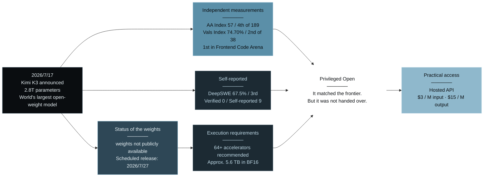
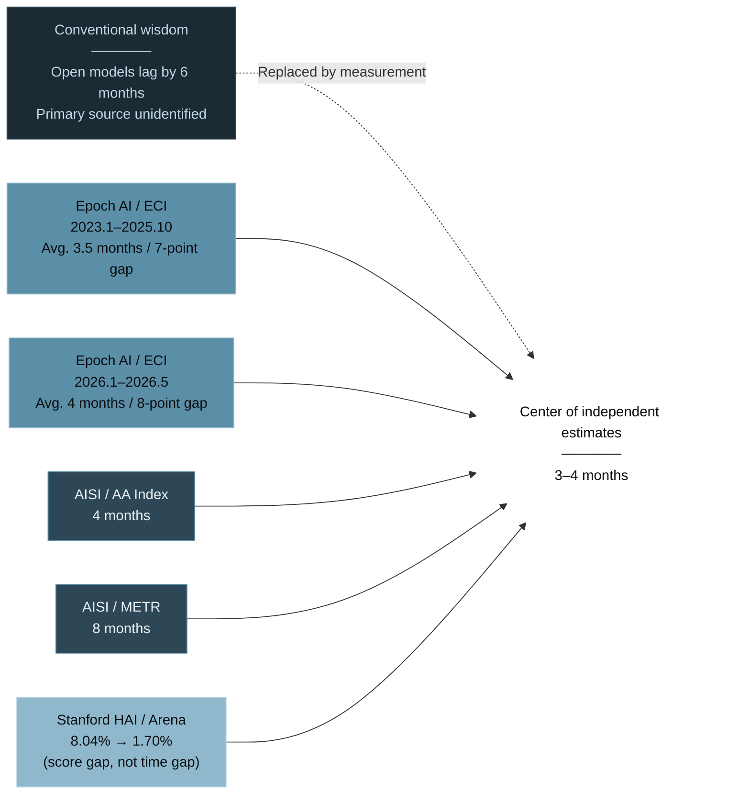
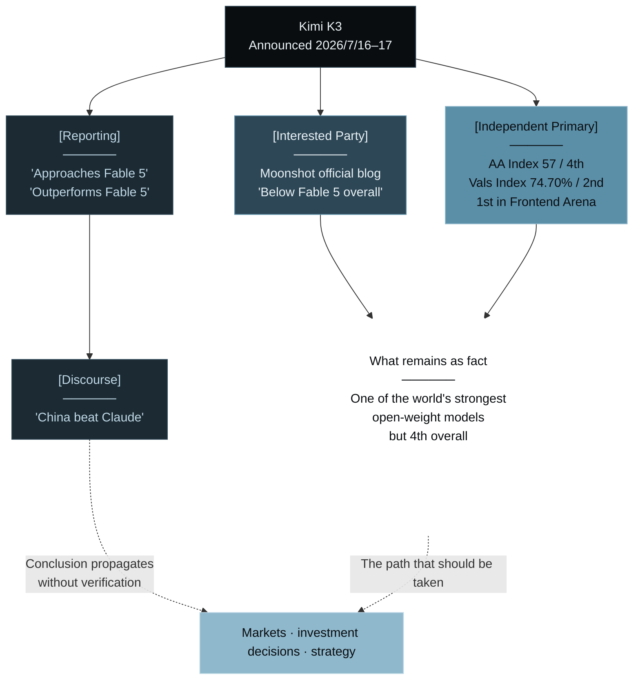
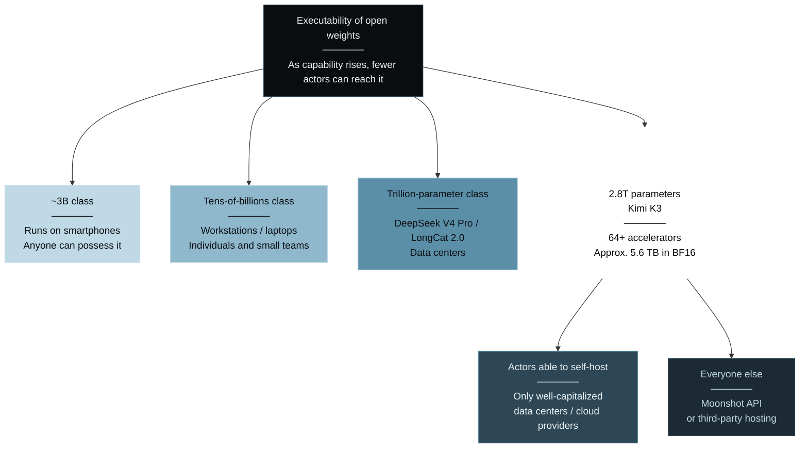
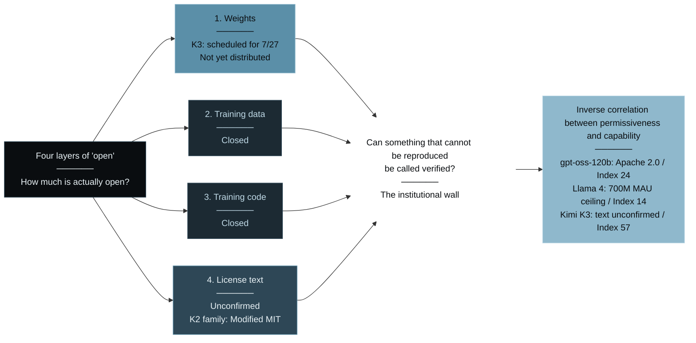
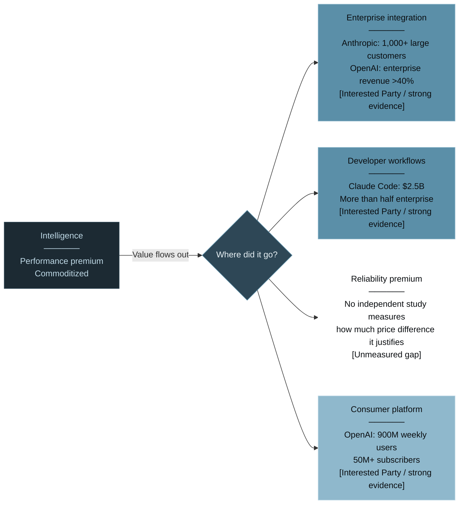
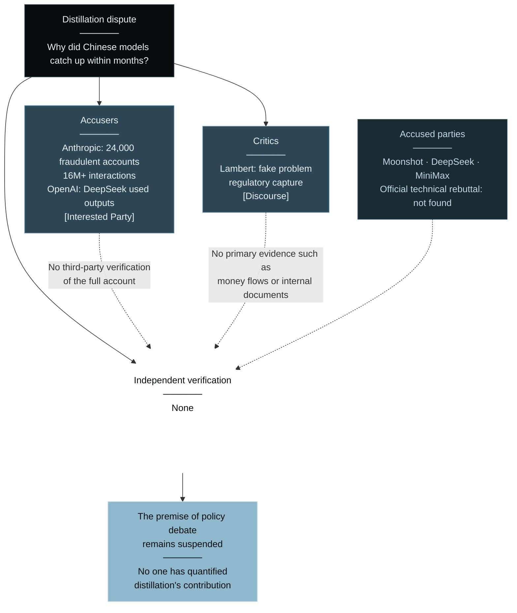
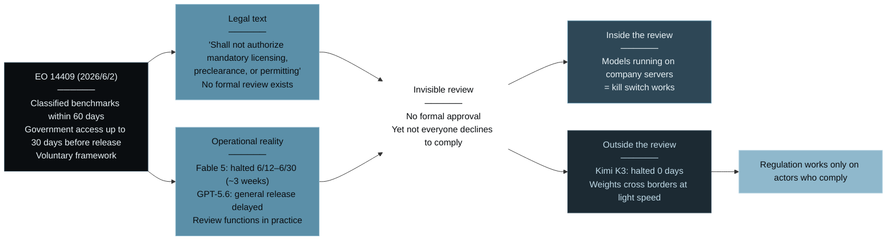
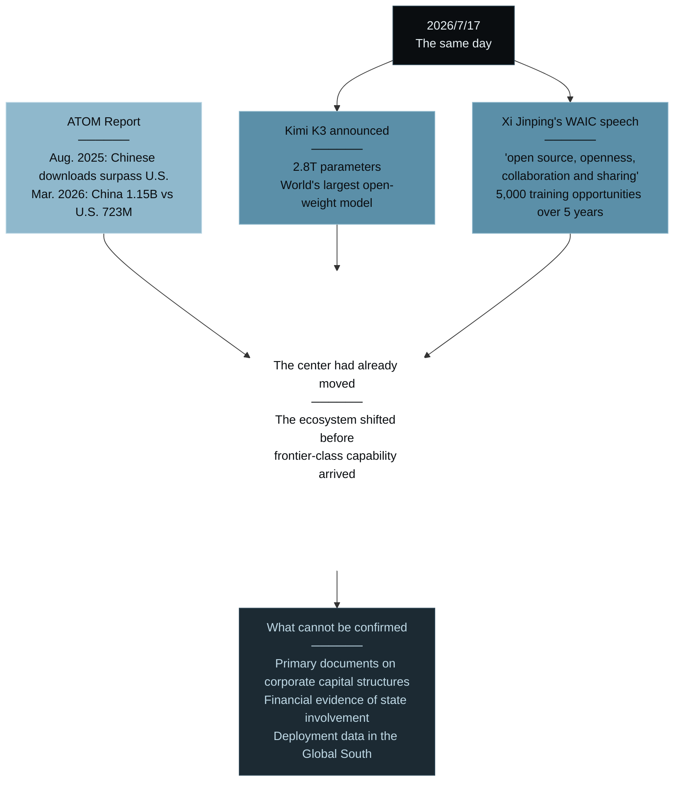

# Frontier-Grade Open Weights — Have Frontier-Class Open-Weight Models Truly Opened Up?

> **"They matched the frontier. But no one can hold them."**

 

---

# Prologue: The Day Everyone Said It Had Opened

July 17, 2026, Beijing. 
Chinese AI company Moonshot AI announced a new 2.8-trillion-parameter model, Kimi K3. 
It was the largest open-weight model in the world—at least among models whose trained parameters were to be released. 
Reuters reported that its performance was “approaching Anthropic’s state-of-the-art model, Fable.”

The market delivered its verdict that same day. 
A single sentence—that open weights had reached the frontier—shook assumptions worth hundreds of billions of dollars. 
But that day, there was another fact.

**The weights had not been released.**

At the time, independent evaluator Artificial Analysis labeled Kimi K3 **“weights not publicly available.”** 
Another independent evaluator, Vals AI, went further, listing the license type as **“Proprietary — contact us to get access.”** 
Moonshot’s own official blog promised only that the full weights would be released on **July 27, 2026**.

The world’s largest open-weight model was not yet open on the day it was announced. 
This book begins in that ten-day gap.

## The World’s Largest Open-Weight Model Reached the Frontier

First, let us establish what actually happened.

According to measurements by the independent organization Artificial Analysis, Kimi K3 scored **57** on the Intelligence Index, ranking **4th out of 189 models**. 
The only models above it were Claude Fable 5 at 60 and GPT-5.6 Sol at 59. 
K3 landed at **roughly the same level** as GPT-5.5 and Claude Opus 4.8. 
On the Vals Index, produced by another independent evaluator, it scored **74.70% (±0.96)**, ranking **2nd out of 38 models**. 
And in Arena.ai’s Frontend Code Arena—a human blind-preference evaluation—**K3 surpassed Claude Fable 5 and took first place**.

One point requires precision. 
Of the claims that K3 was “approaching Fable 5” or “substantially outperforming Opus 4.8 and GPT-5.6 Sol,” 
**independent organizations measured only the aggregate indices and arena rankings**. 
Moonshot’s own technical blog claimed that K3 outperformed Opus 4.8 and GPT-5.6 Sol on its internal coding benchmarks, including GPU-kernel optimization, 
while also assessing that **its overall performance remained below Claude Fable 5**. 
In other words, some of the areas in which the model was reported to have “surpassed” the frontier include areas where the company itself wrote that it had not.

The boundary between self-reporting and independent measurement appears in an even more explicit form. 
On the DeepSWE Leaderboard, K3 is listed in third place with a score of 67.5%. 
But the same page states: **Verified 0 / Self-reported 9**. 
Zero verified entries. All nine listed entries are self-reported.

Why insist on this distinction? 
Because in shocks of this kind, numbers take on lives of their own. 
The story that “a Chinese open model beat Claude” is simple and highly shareable. 
But the independent measurements show “fourth overall” and “first in a specific domain.” 
This book was written not to ride the wave of excitement, but to understand the **structure** of that excitement. 
That is why precision matters from the very first number.

And once we insist on precision, a more important fact emerges. 
**The conventional wisdom that “open weights lag by six months” was already dead.** 
According to the independent research organization Epoch AI, the capability gap between open and closed models averaged **3.5 months**—a seven-point ECI gap—from January 2023 through October 2025, 
and averaged **four months**—an eight-point ECI gap—from January 2026 through May 28. 
Kimi K3 was not a mutation. It was merely the endpoint of a distance that had been narrowing for three years.

But matching performance and having that performance placed in your hands are two different things. 
What happened on July 17, 2026 can be summarized in a single diagram.

The areas reached by independent measurement are brightly lit, while self-reporting and physical constraints remain dark. 
And every path converges on a single point. 
On the day it was announced, the only practical gateway to the world’s largest open-weight model was Moonshot’s API.

## What This Book Means by “Privileged Open”

So: can you actually run the model that matched the frontier?

Moonshot writes in its official blog that inference efficiency benefits from a large high-bandwidth communication domain, and therefore **recommends deployment on a supernode with at least 64 accelerators**. 
The weights of a 2.8-trillion-parameter model require approximately 5.6 TB in BF16, 2.8 TB in INT8, and even 1.4 TB in INT4, based on simple arithmetic from the total parameter count. 
**Being able to download a model and being able to run it are different things.** 
For most users, the only realistic option is a hosted API—in other words, paying Moonshot. 
$3 per million input tokens and $15 per million output tokens. An open-weight model is being sold as a paid API.

This book captures that condition in a single phrase: **Privileged Open**.

Privileged Open describes a state in which **a model is indeed open in the sense that its weights are released, 
yet the ability to possess, run, and modify those weights remains concentrated among a limited set of actors**. 
No one owns it exclusively. But not everyone can use it. 
The release is real; access is an illusion.

Why introduce “Privileged Open” instead of relying on the established term “open weight”? 
Because as long as the debate remains trapped in the binary of “open versus closed,” 
we will **permanently misidentify what actually moved**. 
What moved was not ownership of the model. What moved was the **location of scarcity**. 
Intelligence is no longer scarce. So what is scarce now? 
The entire argument of this book is contained in that one question.

| | “Openness” in the conventional narrative | Privileged Open (this book’s observation) |
|---|---|---|
| Release of weights | Release means anyone can obtain them | Release is scheduled; obtaining and running are separate issues |
| Execution environment | Runs locally | A supernode-class environment with 64 accelerators is recommended |
| Practical usage model | Self-hosting | Paying for a hosted API ($3/$15) |
| Verifiability | Anyone can reproduce it | Independent verification is impossible until the weights are released |
| License | Equivalent to open source | K3’s formal license text remains unconfirmed |
| Outcome | Democratization of intelligence | Reconcentration of intelligence |

## Who This Book Is For—and Its Map

This book is written for three groups.

* First, **executives and AI strategy leaders being asked, “A Chinese open model has arrived. Should we change our strategy?”** 
Some parts should change; others should not. The data draws that line clearly.

* Second, **investors, business developers, and engineers staking capital or careers on the future of the AI-lab industry**. 
Neither “proprietary will collapse” nor “nothing will change” is supported by the data.

* Third, **readers who want to understand AI regulation and geopolitics as structures rather than headlines**. 
The American frontier effectively passes through a pre-release review. And every review has an outside.

The map of the book is as follows. 
First, we establish the fact that the distance narrowed and then stabilized (Chapter 1). 
Next, we ask who measured that fact and confront the limits of measurement itself (Chapter 2). 
Then we dissect why release still does not mean transfer, through the **wall of physics** (Chapter 3) and the **wall of institutions** (Chapter 4). 
We then test, using primary revenue data, what AI labs are selling after intelligence itself ceases to be scarce (Chapter 5), 
and show that distillation—the central dispute—is blocked by a **wall of evidence** (Chapter 6). 
Finally, we examine what is happening outside the **wall of review** (Chapter 7), 
and move to the day openness became the language of the state, crossing the **wall of nations** (Chapter 8).

The walls expand from matter to discourse, from individuals to states. 
Yet at every layer, the same proposition repeats itself. 
The frontier opened. But it did not become “open.” 
In a world where both statements are true at once, what is scarce—and who wins? 
We will answer, step by step, from primary data and structure.

### References

1. Reuters, “China AI firm Moonshot unveils new model said to approach ‘Fable’ performance” (July 17, 2026)
2. Moonshot AI, “Kimi K3 Tech Blog: Open Frontier Intelligence” (July 16, 2026)
   <https://www.kimi.com/blog/kimi-k3>
3. Artificial Analysis, “Kimi K3 – Intelligence, Performance & Price Analysis” (weights not publicly available)
   <https://artificialanalysis.ai/models/kimi-k3>
4. Vals AI, “Kimi K3” (Vals Index 74.70% ±0.96 / 2nd of 38 models / License type: Proprietary)
   <https://www.vals.ai/models/kimi_kimi-k3>
5. LLM Stats, “DeepSWE Leaderboard” (K3 67.5%, 3rd / Verified 0 / Self-reported 9)
   <https://llm-stats.com/benchmarks/deepswe>
6. Epoch AI, “Open-weight models lag state-of-the-art by around 3 months on average” (October 30, 2025)
   <https://epoch.ai/data-insights/open-weights-vs-closed-weights-models>
7. Epoch AI, “Open models lag state-of-the-art closed models by 4 months” (May 29, 2026)
   <https://epoch.ai/data-insights/open-closed-eci-gap>

 

---

# Chapter 1: Six Months Had Become Three

“Open weights have caught up with the frontier.” In July 2026, that sentence traveled around the world. 
But if they had caught up, how far behind had they been?

Most people answer: six months. 
Open-weight models lag the proprietary frontier by about six months—an industry cliché. 
But who measured those six months?

## No One Knows Where the Conventional Wisdom Came From

In the research for this book, I could not identify a primary source for the figure “six months.” 
It circulates widely, appears in articles, and even serves as an assumption in investment decisions, 
yet it cannot be traced to an independent study using a rigorous methodology.

There are, however, organizations that **do measure the gap**. 
And their number is not six months.

The independent research organization Epoch AI continuously measures the capability gap between open and closed models using its Epoch Capabilities Index (ECI). 
Its published figure as of October 30, 2025 was: 
**From January 2023 through October 2025, the average lag was 3.5 months, with a seven-point ECI gap.**

In its May 29, 2026 update, the figure became: 
**From January 1 through May 28, 2026, the average lag was four months, with an eight-point ECI gap.** 
Under a stricter criterion, six months.

In other words, the conventional “six months” was the upper bound under the most conservative standard. 
The center of the empirical estimate is three to four months. 
**The distance had already narrowed long before Kimi K3 appeared.**

## Measure the Same Phenomenon, Get an Answer Twice as Large

There is another important fact. 
Depending on the evaluator, the answer differs by more than a factor of two.

The UK AI Security Institute (AISI), in its July 2026 Frontier AI Trends Report, summarized the gap as follows: 
**Four months using Artificial Analysis’s Intelligence Index. 
Eight months using METR’s time-horizon tasks.**

Both are independent organizations. Both take measurement seriously. 
Yet **the answer doubles depending on how “capability” is defined**.

Stanford HAI’s AI Index 2025 offers another perspective. 
In Chatbot Arena, the gap between open and closed models narrowed 
from 8.04% in January 2024 to 1.70% in February 2025. 
That is a score gap, not a time gap.

Three independent organizations use three different metrics and produce three different numbers. 
But they agree on the direction: **the gap has narrowed from years to months.**

## Kimi K3 Is Only One Model in a Line

The gap did not narrow because K3 was uniquely exceptional. 
In the first half of 2026, open-weight models claiming frontier-class performance appeared in succession.

* **DeepSeek V4 Pro**: 1.6 trillion parameters / 49B active / one-million-token context (April 2026)
* **Meituan LongCat 2.0**: 1.6 trillion parameters / average 48B active / one-million-token context (June 30, 2026). Officially announced as having completed the entire training-to-inference pipeline on a domestic computing cluster
* **MiniMax M3**: one-million-token context and native multimodality; self-described as “the first open-weight model with three frontier capabilities”
* **GLM-5.2**: 81.0 on Terminal-Bench 2.1 and 62.1 on SWE-bench Pro

Then Kimi K3 moved to the front of the line with 2.8 trillion parameters. 
Its architecture is Stable LatentMoE—an extremely sparse design in which only 16 of 896 experts are active. 
Out of 2.8 trillion total parameters, only 32B are active: just 1.8%. 
The design uses sparsity to combine vast knowledge capacity with efficient inference.

What about open weights from the United States? 
OpenAI’s gpt-oss-120b is released under Apache 2.0, a genuinely permissive license, 
but it has 117B parameters (5.1B active) and an Artificial Analysis Intelligence Index of 24. 
Meta’s Llama 4 Maverick has 402B parameters, 17B active, a one-million-token context window, and an Index of 14.

Place those scores against Kimi K3 at 57, Fable 5 at 60, and GPT-5.6 Sol at 59, and the landscape is unmistakable. 
**The issue is not that “the United States has no open-weight models.” 
It is that American open weights are no longer the protagonists of frontier-class open weights.**

## The Gap Narrowed—and Then Stabilized

We can compress the facts so far into one proposition.

**The distance between open and closed models narrowed over three years, then stabilized at a scale of several months.**

What is surprising is not that Kimi K3 arrived. 
What is surprising is that **the industry debated using the figure “six months” without anyone knowing the actual distance**. 
Conventional wisdom was replaced by measurement. And measurement produced a shorter number.

But we should not stop here. 
Epoch AI, AISI, and Stanford HAI are all independent evaluators. 
So who measured the numbers circulating about Kimi K3 itself?

The next chapter asks that question.

### References

1. Epoch AI, “Open-weight models lag state-of-the-art by around 3 months on average” (October 30, 2025; average 3.5-month lag / 7-point ECI gap from January 2023 to October 2025)
   <https://epoch.ai/data-insights/open-weights-vs-closed-weights-models>
2. Epoch AI, “Open models lag state-of-the-art closed models by 4 months” (May 29, 2026; average four-month lag / eight-point ECI gap from January to May 28, 2026 / six months under stricter criteria)
   <https://epoch.ai/data-insights/open-closed-eci-gap>
3. UK AI Security Institute, “Frontier AI Trends Report” (July 2026; four months by AA Index / eight months by METR time horizon)
   <https://www.aisi.gov.uk/frontier-ai-trends-report>
4. Stanford HAI, “Technical Performance | The 2025 AI Index Report” (Chatbot Arena gap: 8.04% in January 2024 → 1.70% in February 2025)
   <https://hai.stanford.edu/ai-index/2025-ai-index-report/technical-performance>
5. Moonshot AI, “Kimi K3 Tech Blog” (2.8T total parameters / 32B active / Stable LatentMoE with 16 of 896 experts active / Kimi Delta Attention / one-million-token context)
   <https://www.kimi.com/blog/kimi-k3>
6. DeepSeek, “DeepSeek-V4-Pro” (1.6T / 49B active / one-million-token context)
   <https://huggingface.co/deepseek-ai/DeepSeek-V4-Pro>
7. Meituan Technology, “LongCat-2.0 Officially Released” (June 30, 2026; 1.6T / average 48B active / entire pipeline completed on domestic computing clusters)
   <https://tech.meituan.com/2026/06/30/LongCat2.0.html>
8. MiniMax, “MiniMax M3”
   <https://www.minimax.io/models/text/m3>
9. zai-org, “GLM-5” (Terminal-Bench 2.1: 81.0 / SWE-bench Pro: 62.1)
   <https://github.com/zai-org/GLM-5>
10. OpenAI, “Introducing gpt-oss” (Apache 2.0 / 117B, 5.1B active)
    <https://openai.com/index/introducing-gpt-oss/>
11. Artificial Analysis, “Llama 4 Maverick” (402B / 17B active / Index 14)
    <https://artificialanalysis.ai/models/llama-4-maverick>

 

---
# Chapter 2: Who Measured That Number?

There are numbers now circulating worldwide about Kimi K3. 
Terminal-Bench 2.1. GPQA-Diamond. DeepSWE. An advantage in GPU-kernel optimization. 
Who measured them?

The answer is simple: **mostly Moonshot itself.**

## Five Categories Change the Landscape

This book classifies every number and claim into five categories.

| Category | Definition | Examples |
|---|---|---|
| **[Independent Primary]** | Academic papers, independent evaluators, public agencies, government documents | Epoch AI, Artificial Analysis, Vals AI, AISI, the text of executive orders |
| **[Interested Party]** | Announcements and self-reported benchmarks from the company being evaluated | Moonshot’s official blog, Anthropic’s official releases |
| **[Stakeholder]** | Communications from actors who benefit if the number is favorable | VC research, market estimates from organizations with portfolio exposure |
| **[Reporting]** | News organizations reporting from primary materials and interviews | Reuters, Tom’s Hardware |
| **[Discourse]** | Opinions and forecasts without primary data | Blogs, analyst essays |

Once this classification is applied, the Kimi K3 landscape changes.

Only four points can be confirmed through **[Independent Primary]** sources:

* Artificial Analysis: Intelligence Index **57**, **4th of 189 models**; Fable 5 scored 60 and GPT-5.6 Sol scored 59
* Vals AI: Vals Index **74.70% (±0.96)**, **2nd of 38 models**
* Arena.ai (Frontend Code Arena): **1st place**, ahead of Fable 5
* Artificial Analysis / Vals AI: **weights unreleased / license shown as Proprietary**

Nearly everything else remains **[Interested Party]** reporting:

* 2.8 trillion parameters, 32B active, 16 of 896 experts active, Kimi Delta Attention
* The claim that K3 outperformed Opus 4.8 and GPT-5.6 Sol on GPU-kernel optimization benchmarks
* The deployment recommendation of at least 64 accelerators
* The scheduled release of all weights on July 27
* API pricing of $3/$15, with cached input at $0.30

The most symbolic example is the DeepSWE Leaderboard. 
K3 is listed in third place with a score of 67.5%. 
But the same page says: **Verified 0 / Self-reported 9**. 
All nine listed entries are self-reported; none are verified. 
**Appearing on a leaderboard and being verified are different things.**

## The Company Itself Says It Did Not Surpass the Frontier

Here, an intriguing reversal occurs.

Moonshot’s technical blog claims an advantage on internal benchmarks such as GPU-kernel optimization, 
but assesses that **K3’s overall performance remains below Claude Fable 5**. 
In other words, the strongest voices saying “K3 beat Fable 5” are not Moonshot’s. 
They belong to **the media and the discourse that followed**.

Independent measurements support this distinction. 
Artificial Analysis and Vals AI position K3 as one of the strongest open-weight models in the world and close to the frontier, 
but not as a model that has surpassed the frontier overall. 
Its first-place finish in Frontend Code Arena is real, but it concerns **the specific task of building web interfaces**.

**A first-place result on one task was read as an overall reversal.** 
That was the largest misreading of July 2026.

## Do Not Call the Unverifiable “Verified”

There is one more decisive fact. 
In the research for this book, **I found no report in which an independent third party deployed K3’s complete weights in its own environment 
and rigorously measured inference cost, effective VRAM consumption, and latency.**

The reason is simple: **the weights had not yet been distributed.** 
Until their July 27 release, independent verification at the hardware layer was physically impossible.

That means every practical evaluation of K3 currently in circulation depends on either: 
(1) Moonshot’s own reporting, or (2) measurement through an API operated by Moonshot.

**Measuring through an API is not measuring the model. 
It is measuring a composite of the model and the operations of the provider serving it.**

This is not a trivial distinction. 
Quantization settings, batching, routing, caching—outsiders cannot know what happens behind the API. 
Only when the weights are in hand does the measurement become a measurement of the model itself.

## Measurement Immaturity Is the Industry’s True Condition

As Chapter 1 showed, different evaluators can measure the same phenomenon and produce answers that differ by a factor of two. 
As this chapter has shown, leaderboard placement does not imply verification. 
And the most basic form of verification—obtaining the weights and running them—has not yet been possible for anyone.

**This industry still lacks the means to measure accurately what it has built.**

Yet the numbers move. 
Capital moves, strategy moves, and regulatory debate moves. 
Unverifiable numbers become assumptions without ever being verified.

That is why every chapter that follows makes the classification explicit. 
Who measured it? Does that person benefit if the number is large? 
**Continuing to ask those two questions is the only form of intellectual honesty currently available in this field.**

The next chapter directs that honesty toward the harshest fact of all: 
even if the weights are released on July 27, can you run them?

### References

1. Artificial Analysis, “Kimi K3 – Intelligence, Performance & Price Analysis” (Intelligence Index 57 / weights not publicly available)
   <https://artificialanalysis.ai/models/kimi-k3>
2. Artificial Analysis, “AI Model & API Providers Analysis” (Fable 5 = 60 / GPT-5.6 Sol = 59 / Kimi K3 = 57)
   <https://artificialanalysis.ai/>
3. Vals AI, “Kimi K3” (Vals Index 74.70% ±0.96 / 2nd of 38 / License type: Proprietary)
   <https://www.vals.ai/models/kimi_kimi-k3>
4. LLM Stats, “DeepSWE Leaderboard” (K3 67.5%, 3rd / **Verified 0 / Self-reported 9**)
   <https://llm-stats.com/benchmarks/deepswe>
5. Moonshot AI, “Kimi K3 Tech Blog: Open Frontier Intelligence” (claims of superiority on internal benchmarks and self-assessment that overall performance remains below Fable 5)
   <https://www.kimi.com/blog/kimi-k3>
6. Tom’s Hardware, “China’s 2.8-trillion-parameter Kimi K3 beats Claude Fable 5 in Frontend Code Arena benchmark” (July 2026)
   <https://www.tomshardware.com/tech-industry/artificial-intelligence/moonshot-releases-2-8-trillion-parameter-kimi-k3>

 

---

# Chapter 3: The Open Door That Weighs 1.7 Terabytes

The term “open weight” contains a promise: 
that anyone can download the model and run it in their own environment. 
That promise collapses in front of 2.8 trillion parameters.

## The Number 64

Moonshot’s official blog states that inference efficiency benefits from a large high-bandwidth communication domain, 
and therefore **recommends deployment on a supernode composed of at least 64 accelerators**.

This is not a luxurious recommendation for users chasing maximum performance. 
It is **close to a practical minimum**. 
Moreover, Moonshot implemented quantization—MXFP4 weights and MXFP8 activations—from the SFT stage onward. 
In other words, **even after compression, the model still calls for 64 accelerators**.

We can estimate the physical size of the weights arithmetically from the total parameter count. 
Approximately **5.6 TB** in BF16. **2.8 TB** even in INT8. About **1.4 TB** pushed to INT4. 
These are estimates derived from Moonshot’s reported total parameter count; 
the required configuration varies depending on how all MoE experts are stored and what quantization the official implementation supports. 
But one fact does not change. 
**This is not the kind of model that runs on a single consumer GPU.**

## Sparsity Does Not Reduce the Storage Requirement

One misconception must be resolved here. 
K3 activates only 16 of its 896 experts. 
Its active parameter count is 32B—just 1.8% of the total. 
It is natural to think: “Doesn’t that make it lightweight?”

But sparsity reduces **computation**, not the **memory footprint**. 
Because the experts invoked depend on the input, **all 896 must remain available locally**. 
The computation is efficient. The storage requirement remains 1.4–5.6 TB.

Sparsity makes inference cheaper. It does not make entry cheaper.

## A Proposition I Wrote Breaks Here

On March 1, 2026, I published a book titled *The Edge of Intelligence*. 
Its central proposition was: **the marginal cost of on-device AI is zero.** 
A $20 monthly subscription becomes an optional luxury when equivalent AI runs free on your own device. 
Consumers therefore move irreversibly toward on-device AI.

That proposition is **true for small models such as Nanbeige 4.1 3B**. 
For Kimi K3, it is **false**.

Marginal cost falls to zero only when you can place the weights in your own environment. 
If you cannot, Moonshot sets the marginal cost. 
$3 per million input tokens and $15 per million output tokens—pricing in the GPT-5.6 Terra range, and **not cheap**.

**Open weights are not monolithic.** 
They are stratified by executability: the higher the layer, the greater the capability and the fewer the actors able to reach it. 
In July 2026, it was the **highest layer** that reached the frontier. 
The layer being democratized and the layer reaching the frontier are not the same layer.

I will break my own proposition myself. 
That, I believe, is the minimum discipline required when writing from primary information.

## Where Is the “Cheap” Part?

Looking across the full pricing landscape reveals another fact. 
Artificial Analysis’s cost-per-task comparison for July 2026 was as follows.

| Model | Cost per task | Classification |
|---|---:|---|
| Claude Fable 5 | **$2.75** | Proprietary |
| GPT-5.6 Sol | **$1.04** | Proprietary |
| **Kimi K3** | **$0.94** | Open weight (planned) |
| GLM-5.2 | **$0.47** | Open family |
| DeepSeek V4 Pro | **$0.04** | Open weight |
| Llama 4 Maverick | **$0.03** | Open family |

K3 costs roughly one-third as much as Fable 5, but **23 times** as much as DeepSeek V4 Pro. 
“Open weight” does not mean “cheap.” 
**A frontier-class premium has emerged within open weights themselves.**

This is the economic face of Privileged Open. 
A company promises to release the weights while selling practical access to their capability through a paid API. 
DeepSeek sells at $0.04; K3 sells at $0.94. 
Both call themselves “open weight.” **The same term conceals a 23-fold price difference.**

## Even When the Weights Are Released, They Are Not Immediately Usable

The physical wall does not vanish the moment weights are published. 
**It persists afterward, in the form of time.**

Until now, Chinese open-weight releases followed a pattern. 
When the RL run finished, weights appeared within hours—within a week at the latest. 
And the ecosystem knew immediately how to run them. 
Patches for inference engines were sometimes prepared days before release.

With Kimi K3, that pattern is unlikely to hold.

On Interconnects, Florian Brand puts it plainly. 
**Loading the weights alone requires a full node of B300s.** 
Getting the model into a fine-tunable state will take substantial engineering and time.

Nathan Lambert reframes this as a question of the time gap. 
Closed labs complete this optimization behind the scenes before announcing a model. 
In doing so, they **manipulate the very interval that gets observed as a performance gap.** 
Open-weight advocates have long argued that the gap should be measured only from the moment a closed model becomes available.

Now the same dynamic has appeared on the open side. 
**Between the release of weights and their becoming usable, an interval on the order of a month can open up.** 
Kimi's inference API is already overwhelmed—demand has outrun supply, and it is failing. 
The model has been published, and it is not diffusing.

Here lies the practical consequence of this book's proposition. 
**The date of publication and the date of arrival are different dates.** 
And what determines the interval between them is neither license nor politics, but **whether you own the hardware to run it.**

For an organization that can buy 64 accelerators, that interval is short. 
For one that cannot, it is, in practice, infinite.

## The Open Door—and Its Weight

On July 27, the weights may be released. 
The door will open. Everyone will be told they may enter.

But beyond the door lies 1.4–5.6 terabytes of mass, 
64 accelerators, and the capital required to purchase them. 
**Release does not mean the distribution of capability.**

The wall of physics is neither malice nor conspiracy. 
It simply exists. No one bars the way, yet almost no one can pass. 
This is the first face of Privileged Open.

The next chapter examines the second: 
even if the door opens, **no one yet knows the conditions under which they are allowed to enter**.

### References

1. Moonshot AI, “Kimi K3 Tech Blog: Open Frontier Intelligence” (supernode with 64+ accelerators recommended / MXFP4 weights and MXFP8 activations / Stable LatentMoE with 16 of 896 experts active / API prices of $3 and $15, cached input $0.30)
   <https://www.kimi.com/blog/kimi-k3>
2. Artificial Analysis, “gpt-oss-120b – Intelligence, Performance & Price Analysis” (cost per task: Fable 5 $2.75 / GPT-5.6 Sol $1.04 / Kimi K3 $0.94 / GLM-5.2 $0.47 / DeepSeek V4 Pro $0.04 / Llama 4 Maverick $0.03)
   <https://artificialanalysis.ai/models/gpt-oss-120b>
3. Nathan Lambert & Florian Brand (Interconnects), “Open models recap: more on Kimi K3, Qwen 3.8, Xi’s WAIC speech, distillation, the open-closed gap, and what’s next” (July 22, 2026; loading the weights alone requires a full B300 node; substantial engineering needed to reach a fine-tunable state; Kimi’s API overwhelmed by demand)
   <https://www.interconnects.ai/p/open-models-recap-more-on-kimi-k3>
4. Satoshi Yamauchi, *The Edge of Intelligence — The Age When AI Runs on Your Device* (Leading.AI / CC BY 4.0)
   <https://github.com/Leading-AI-IO/edge-ai-intelligence>
5. MarkTechPost, “Moonshot AI Releases Kimi K3: A 2.8 Trillion Parameter Open MoE Model With Kimi Delta Attention and 1M Context” (July 16, 2026)
   <https://www.marktechpost.com/2026/07/16/moonshot-ai-releases-kimi-k3-a-2-8-trillion-parameter-open-moe-model-with-kimi-delta-attention-and-1m-context/>

*The weight-size figures—approximately 5.6 TB in BF16, 2.8 TB in INT8, and 1.4 TB in INT4—are arithmetic estimates based on Moonshot’s reported total of 2.8 trillion parameters, not figures officially disclosed by Moonshot.*

 

---

# Chapter 4: Release Without a License

As of July 18, 2026, one thing about Kimi K3 could not be confirmed: 
**the conditions under which it could be used.**

## In Independent Evaluators’ Registries, It Was Proprietary

Vals AI’s Kimi K3 page stated: 
**License type: Proprietary (contact us to get access).**

Artificial Analysis displayed: **weights not publicly available**.

Two days after its announcement, the world’s largest open-weight model 
was still listed as proprietary in independent evaluators’ databases. 
This is not irony. It is **an accurate third-party record of the observed distribution state**.

The hierarchy of independence must be made explicit. 
Moonshot’s announcement expressed an **intention** to make the model open. 
Vals AI and Artificial Analysis recorded the **state** that the model had not yet been distributed. 
**State is stronger than intention.**

## There Is Precedent, but No Text

In the research for this book, **I could not locate the complete formal license for K3.** 
The redistribution conditions, whether military use was restricted, and whether modified versions had to be disclosed all remained unconfirmed.

The only text I found belonged to the previous generation. 
The Kimi K2 family uses a **Modified MIT** license. 
For commercial services with more than **100 million monthly active users or more than $20 million in monthly revenue**, 
the license triggers an obligation to display “Kimi K2 / K2.5” in the user interface.

Some specialist media reported that K3 would use the same Modified MIT license. 
But that is an inference from precedent, not confirmation from the text. 
**The fact that K2 used Modified MIT does not guarantee that K3 does.**

Why does this matter? 
Because licensing directly determines how much power an open-weight model has to disrupt an industry. 
Is commercial use unrestricted? Is redistribution unrestricted? Is military use restricted? Must modifications be published? 
**Depending on the combination of those four conditions, the same weights become a completely different strategic asset.**

## “Open Weight” Is Not “Open Source”

We must settle the definitions.

**Open source** means the blueprint of software is released so that anyone can reproduce, modify, and redistribute it. 
**Open weight** means that **only the files containing trained parameters** are released.

Kimi K3 was scheduled to release the latter. 
The training pipeline would not be released. 
The complete source code for the architecture would not be released. 
**The training data itself would not be released.**

There is no established academic or technical consensus that this qualifies as “open source.” 
Threshold clauses such as those in Modified MIT—100 million MAU or $20 million in monthly revenue—also depart from 
the Open Source Initiative’s definition, which requires unconditional redistribution and commercial use.

Meta has a similar structure. 
The Llama 4 Community License contains a ceiling of **700 million MAU**. 
The genuinely permissive case is OpenAI’s gpt-oss-120b under Apache 2.0. 
**And gpt-oss-120b has an Intelligence Index of 24.**

**Permissiveness and capability are now inversely correlated.** 
The model with the most open license is furthest from the frontier. 
The open-weight model closest to the frontier had not even disclosed its license.

## Within Six Days, the Factual Foundation Will Be Rewritten

From July 18, 2026—the date this book was written—three events were scheduled within a span of only six days.

* **July 27**: Moonshot’s promised release date for the full weights. Only then would independent third-party verification become possible
* **August 1**: The 60-day deadline under U.S. Executive Order 14409, when agencies including the NSA were to define criteria for “covered frontier models”
* **August 2**: Enforcement authority for the EU AI Act’s GPAI obligations was to take effect

This book was therefore written **immediately before the structure became fixed**. 
That is not a weakness. 
There is value in stating now what will and will not become settled six days later. 
Written after the fact, it becomes commentary. Written before the fact, it becomes a testable prediction.

The prediction of this book is: 
**Even if the weights are released on July 27, Privileged Open will not disappear.** 
The 64-accelerator requirement will remain. The 1.4–5.6 TB mass will remain. 
And if the license contains threshold clauses, the largest commercial uses will carry the most conditions. 
**What disappears is unverifiability—not inaccessibility.**

## No One Locked the Door. Yet No One Can Enter

The wall of physics (Chapter 3) and the wall of institutions (this chapter) express the same point from different angles.

**Openness is not a declaration or an intention. It is a state.** 
And openness as a state requires not only distributed weights, 
but also the resources to execute them, the conditions under which they may be used, and the materials required to reproduce them. 
At that moment, Kimi K3 possessed none of the four. **They were only promised.**

The next chapter changes perspective. 
Suppose everything is provided: the weights are distributed, the conditions are clear, and someone can run the model. 
Then **what do AI labs sell in order to survive?**

### References

1. Vals AI, “Kimi K3” (**License type: Proprietary — contact us to get access**)
   <https://www.vals.ai/models/kimi_kimi-k3>
2. Artificial Analysis, “Kimi K3” (**weights not publicly available**)
   <https://artificialanalysis.ai/models/kimi-k3>
3. Moonshot AI, “Kimi-K2 LICENSE” (Modified MIT / attribution obligation above 100M MAU or $20M monthly revenue)
   <https://github.com/moonshotai/Kimi-K2/blob/main/LICENSE>
4. OpenAI, “Introducing gpt-oss” (Apache 2.0)
   <https://openai.com/index/introducing-gpt-oss/>
5. Artificial Analysis, “Llama 4 Maverick” (Llama 4 Community License / Index 14)
   <https://artificialanalysis.ai/models/llama-4-maverick>
6. The White House, “Promoting Advanced Artificial Intelligence Innovation and Security” (June 2, 2026; criteria to be developed within 60 days, around August 1, 2026)
   <https://www.whitehouse.gov/presidential-actions/2026/06/promoting-advanced-artificial-intelligence-innovation-and-security/>
7. European Commission, “Guidelines for providers of general-purpose AI models” (GPAI obligations applied from August 2, 2025; **enforcement authority takes effect August 2, 2026**)
   <https://digital-strategy.ec.europa.eu/en/policies/guidelines-gpai-providers>

*As of the research cutoff for this book (July 18, 2026), K3’s formal license text, redistribution conditions, military-use restrictions, and disclosure obligations for modified versions could not be confirmed. Reports describing the license as Modified MIT existed, but the only text verified was that of the K2 family.*

 

---
# Chapter 5: The Day Intelligence Stopped Being the Product

The performance premium collapsed. 
Open weights came within a few months of the frontier. 
According to Epoch AI, inference prices are falling at a pace of **9-fold to 900-fold per year, with a median annual decline of 50-fold**.

So are proprietary AI labs finished?

**The data does not support that conclusion.**

## $47 Billion Is Not Payment for Intelligence

Anthropic’s official disclosures, arranged chronologically, tell the story.

* **February 12, 2026**: Raised $30 billion in a Series G at a post-money valuation of $380 billion. **Run-rate revenue: $14 billion.** The company explicitly identified “enterprises and developers” as the main growth drivers
* **The same day**: **Claude Code alone reached a $2.5 billion run rate**, with **more than half coming from enterprise customers**
* **April 16, 2026**: Revenue rose from approximately $9 billion at the end of 2025 to **more than $30 billion**. The number of customers spending more than $1 million annually increased from over 500 to **more than 1,000**
* **May 28, 2026**: Raised $65 billion in a Series H at a post-money valuation of $965 billion. **Run-rate revenue surpassed $47 billion**

OpenAI disclosed a similar structure on March 31, 2026. 
**Monthly revenue of $2 billion. Nine hundred million weekly active users. More than 50 million subscribers. 
And enterprise revenue exceeding 40% of the total.** 
The company officially stated that its enterprise business was expected to match its consumer business by the end of 2026.

All of these are [Interested Party] disclosures. 
They are not audited financial statements verified by an independent third party. 
But at least one conclusion can be drawn securely from these primary sources.

**The center of AI-lab revenue is no longer “access to the smartest model.”** 
Enterprise deployment. Developer workflows. Cloud delivery. Sales and integration support. 
The fact that Claude Code became an independent $2.5-billion revenue pillar, with more than half coming from enterprise contracts, 
shows that **what is being sold is not intelligence itself, but the machinery that embeds intelligence into work**.

## Enterprise Customers Still Choose Closed Models

According to a Menlo Ventures report dated December 9, 2025, 
enterprise LLM spending was divided as follows: **Anthropic 40%, OpenAI 27%, Google 21%, and open-source models 11%**.

Precision matters here. 
**Menlo is a venture-capital firm and therefore a [Stakeholder].** 
A market estimate published by an actor with investments in AI companies must not be treated as independent primary evidence.

Even so, the figure is consistent with the primary disclosures from OpenAI and Anthropic. 
Enterprise revenue is growing, the number of large enterprise customers has doubled, and businesses are paying for Claude Code. 
Against that background, a world in which **89% of enterprise spending flows to closed providers** is internally coherent.

Menlo also addresses why. 
In domains such as IT and data science, **reliability and deep integrations matter more than speed**.

That suggests the basis of the premium may have shifted 
from “it is the smartest” to “it is easier to deploy internally, more dependable, and able to withstand audit.”

## But the “Reliability Premium” Has Never Been Measured

Here the book must stop and draw a line.

**What percentage of a price differential is justified, on average, by “reliability,” “safety certification,” and “integration support”? 
In the research for this book, I found no independent study that directly measured it.**

What exists are market estimates from [Stakeholders] and self-reported claims from [Interested Parties]. 
The “reliability premium” is one of the most frequently invoked—and **least measured**—concepts in the industry.

The same is true of causality. 
The fall in inference prices is real (Epoch AI, [Independent Primary]). 
The intensification of competition is also real. 
But **no independent study has isolated the direct effect of Kimi K3 or DeepSeek on OpenAI’s or Anthropic’s pricing**. 
We can say that prices fell and competition intensified. 
We must also say that **the causal decomposition remains unresolved**.

The whitest node in the diagram is the one with the weakest empirical foundation. 
**The proposition on which the industry relies most heavily is the one measured least.**

## Open—and Still Sold at a Premium

There is another revealing intersection.

Kimi K3 is sold at $3 for input and $15 for output—**pricing in the Claude Sonnet range**. 
DeepSeek V4 Pro, by contrast, is priced at $0.435 for input and $0.87 for output—**roughly one-seventh to one-seventeenth as much**. 
Both describe themselves as open weight.

In the same week, Anthropic moved its highest-end model to usage-based pricing. 
**Proprietary models are moving away from flat-rate access, while open weights are moving toward paid APIs.** 
The two meet at the point called price.

Europe’s Mistral adopts this structure most explicitly. 
As of April 28, 2026, Mistral Medium 3.5 was officially documented as an **open-weight model under Modified MIT**, 
while the company simultaneously operated proprietary APIs and Le Chat Enterprise. 
**It did not move in one direction from open to closed. 
It was designed from the start to hold both at once.**

That is the structure revealed by K3’s pricing. 
Openness is a means of acquiring **mindshare**; revenue is recovered through the **hosting environment**. 
Distributing weights and charging money are not contradictions.

## No Collapse—but the Product Changes

The conclusion of this chapter can be expressed through two negations.

**“Proprietary will collapse.” The data does not support it.** 
Anthropic’s run rate is $47 billion. It has more than 1,000 customers spending over $1 million annually. OpenAI earns $2 billion per month. 
An estimated 89% of enterprise LLM spending still flows to closed providers (a [Stakeholder] estimate, but one consistent with primary disclosures).

**“Nothing will change.” The data supports that even less.** 
Inference prices are falling at a median rate of 50-fold per year. 
Open weights have come within four months of the frontier. 
And the companies themselves disclose that they are selling integration and reliability, not merely intelligence.

What happens is not collapse. 
**What closed-model companies sell shifts from capability to operational assurance.**

The next chapter enters the largest dispute created by that shift: 
**Was the performance of the Chinese models stolen?**

### References

1. Anthropic, “Anthropic raises $30 billion in Series G funding at $380 billion post-money valuation” (February 12, 2026; $14B run rate / Claude Code $2.5B run rate, more than half enterprise / growth led by enterprises and developers)
   <https://www.anthropic.com/news/anthropic-raises-30-billion-series-g-funding-380-billion-post-money-valuation>
2. Anthropic, “Anthropic expands partnership with Google and Broadcom for multiple gigawatts of next-generation compute” (April 16, 2026; approximately $9B at end-2025 → more than $30B / customers spending more than $1M grew from 500+ to 1,000+)
   <https://www.anthropic.com/news/google-broadcom-partnership-compute>
3. Anthropic, “Anthropic raises $65B in Series H funding at $965B post-money valuation” (May 28, 2026; **run rate $47B**)
   <https://www.anthropic.com/news/series-h>
4. OpenAI, “OpenAI raises $122 billion to accelerate the next phase of AI” (March 31, 2026; $2B monthly revenue / 900M weekly users / 50M+ subscribers / **enterprise revenue above 40%** / expected to match consumer business by year-end 2026)
   <https://openai.com/index/accelerating-the-next-phase-ai/>
5. Menlo Ventures, “2025: The State of Generative AI in the Enterprise” (December 9, 2025; Anthropic 40% / OpenAI 27% / Google 21% / **open source 11%** / reliability and deep integrations matter more than speed) *[Stakeholder]*
   <https://menlovc.com/perspective/2025-the-state-of-generative-ai-in-the-enterprise/>
6. Epoch AI, “LLM inference prices have fallen rapidly but unequally across tasks” (March 12, 2025; **9×–900× annual declines / median 50× per year** / acceleration since 2024)
   <https://epoch.ai/data-insights/llm-inference-price-trends>
7. Mistral AI, “Mistral Medium 3.5 – Model Card” (April 28, 2026; **Modified MIT open weights**)
   <https://docs.mistral.ai/models/model-cards/mistral-medium-3-5-26-04>
8. Mistral AI, “Medium is the new large.” (parallel operation of proprietary API and Le Chat Enterprise)
   <https://mistral.ai/news/mistral-medium-3/>

*Neither OpenAI nor Anthropic discloses a precise three-way split among API, subscription, and enterprise-contract revenue. No independent study found in this research directly measured what percentage of a price differential is justified by a “reliability premium.”*

 

---

# Chapter 6: Distillation—the Accusation That Has Not Been Proven

Why did Chinese open weights reach the frontier within months? 
One explanation now dominates the debate.

**Because they stole it.**

## 24,000 Accounts and 16 Million Interactions

In 2026, Anthropic made an official accusation. 
It claimed that DeepSeek, Moonshot, and MiniMax used **approximately 24,000 fraudulent accounts** 
to conduct **more than 16 million interactions** and extract—distill—Claude’s reasoning capabilities.

Before that, in January 2025, OpenAI told the *Financial Times* that it had seen evidence that DeepSeek used OpenAI outputs for training.

Anthropic accompanied its claim with technical indicators. 
Access through obfuscated routers. Large-scale extraction of chain-of-thought behavior and logic for bypassing safety filters. 
And similarities in outputs.

The implication is clear. 
**The myth that Chinese companies built frontier-class models for a few million dollars is actually the result of free-riding on tens of billions of dollars of American R&D.**

## The Accusation Has Not Been Independently Verified

This is where the classification used by this book matters.

Anthropic’s claim is [Interested Party] evidence. 
The figures 24,000 and 16 million were **calculated from Anthropic’s own logs and published by Anthropic itself**. 
In the research for this book, I found no record of third-party verification.

There is something more important still. 
**I also found no formal rebuttal from Moonshot.** 
Three independent research lines reached the same conclusion: no official technical refutation based on data from the Chinese companies was available.

The current state is therefore:

* Accusers: claims exist, limited evidence has been released, [Interested Party]
* Accused parties: **silence**
* Independent verification: **none**

**This is not yet an established incident. It is still a claim.**

## Even Epoch AI Has Not Measured It

There is another decisive gap.

**How much of the performance gain does distillation explain?** 
How much of Chinese models’ capability comes from genuine technical advances—extreme sparsity, Kimi Delta Attention, and other architectural improvements—and how much depends on extraction from American models?

No study has performed this decomposition quantitatively. 
This is not a minor omission. 
Without it, **the premises of the policy debate over whether open weights should be regulated remain suspended in midair**.

The low-cost mythology around the claim that “DeepSeek trained for $5.5 million” has likewise never been independently audited. 
No primary data objectively proves the cost of training from scratch.

## If the Teacher Is Stronger, Does the Student Get Smarter?

The gap left by unmeasured contribution runs deeper still.

**No one has established why distillation works in the first place.**

On July 22, 2026, Nathan Lambert and Florian Brand took up this question directly on Interconnects. 
The trigger was Ben Thompson of Stratechery, author of one of the most widely read blogs in tech, who had made a strong claim about distillation. 
**As reinforcement learning becomes the center of training, he argued, distillation is becoming more impactful, not less.** 
The Chinese labs, he suggested, are using the strongest models—Fable 5, GPT-5.6—as graders during RL.

Lambert rejects this clearly, on technical and specific grounds.

First, **large RL runs involve millions to tens of millions of rollouts.** 
Figures published by Thinking Machines put their final RL run in the range of twenty to forty million. 
Sending that through the Fable 5 or GPT-5.6 API for grading would be prohibitively expensive. 
Those models are also comparatively slow, making them **a time bottleneck**. 
And there is no guarantee they would outperform a purpose-built grader of one's own.

Second, distillation does its work in the **SFT (supervised fine-tuning)** stage. 
Extract reasoning tokens along with tool calls and you have high-quality SFT data. 
It is also why a model may answer "I am Claude"—personality is formed at this stage. 
But **the core of capability is built during RL, and that is where the money and compute go.**

Third—and this is decisive:

**The proposition that the strongest model makes the best teacher has not been established in the literature.**

By Lambert's account, researchers have revisited this question many times, 
and none have found that the top-performing model in a domain is the best teacher for it. 
The state-of-the-art open SFT dataset is in fact **built on QwQ-32B, an older reasoning model.** 
Why generating completions from GLM-5.2 and running SFT on them does not simply improve a model, no one can explain.

Lambert's own words go further. 
Given a magical API that returned reasoning traces from Claude or Gemini on demand, 
he says he **does not know** whether fine-tuning OLMo on them would make OLMo smarter. 
He calls this one of the wildest unanswered research questions in the field.

The weight of that admission deserves precision. 
The speaker is a researcher who specializes in open-model training methods and trains models himself. 
And he is saying that **not only is distillation's contribution unquantified—whether it works at all cannot be asserted.**

Brand folds the argument into a single refutation. 
If Chinese performance were explained by distillation alone, 
**anyone could use the same data to catch up to GLM or Kimi K3.** 
That is not what has happened.

In the previous section, this book noted that no study decomposes distillation's contribution. 
This section adds something more serious. 
**It is not that the contribution has gone unmeasured. There is not yet a theory of what contributes what.**

And on top of that, policy is being built.

## The Position Reversed Within a Year

Now place Dario Amodei’s statements on a timeline.

Amodei has widely been described as consistently warning about the dangers of open-source AI since his July 2023 testimony before the U.S. Senate. 
(However, the research for this book could not verify the verbatim testimony from a primary source. 
Only multiple secondary references were found. **I therefore avoid asserting the exact content.**)

A primary source that can be verified is his 2026 essay, *The Adolescence of Technology*. 
There, Amodei describes chip export controls as a **“great example … [that] mostly just work.”** 
His position is that **regulation works**.

Then, in 2026, Anthropic publicized the distillation attacks and positioned itself in favor of stronger regulation.

## The Critique of Regulatory Capture

This configuration triggered a fierce response from independent researchers.

On July 12, 2026, Nathan Lambert of *Interconnects* argued that 
**banning open models would not create safety; it would only harm the actors operating in good faith**. 
He called the distillation controversy a **fake problem**, whose real identity was **Anthropic-led regulatory capture**.

The skeleton of the critique is as follows. 
Violating an API’s terms of service is a service-level issue. 
Using that violation as grounds to regulate open-weight models as a category 
is merely political activity designed to **eliminate cheaper alternatives and protect the company’s own high-priced API revenue**.

Has that critique been proven? 
**No.** 
It can be confirmed that OpenAI and Anthropic submitted formal comments to the NTIA in March 2024. 
It can also be confirmed that both warned of CBRN and cyber risks from open weights and requested rigorous safety testing. 
But the research found **no primary evidence sufficient to establish competitive exclusion as the motive—such as money flows or internal draft requests**.

## The Decision Not to Pass Judgment

This book does not declare which side is right. 
**There is not enough independent data to justify a verdict.**

This is not performative neutrality. 
It is the opposite: **it is the strongest claim available**.

On one side, a world-leading AI company makes an accusation based on its own logs. 
On the other, independent researchers question the accuser’s incentives. 
And in the center lies **a gap no one has measured**.

Policy is about to be made on top of that gap. 
On August 1, the American framework is scheduled to become concrete. 
**An unproven accusation may become an institutional premise without ever being proven.**

This is the third face of Privileged Open: the **wall of evidence**.

The next chapter examines the institution itself.

### References

1. Anthropic, “Detecting and preventing distillation attacks” (approximately 24,000 fraudulent accounts / more than 16 million interactions involving DeepSeek, Moonshot, and MiniMax) *[Interested Party]*
   <https://www.anthropic.com/news/detecting-and-preventing-distillation-attacks>
2. Forbes, “OpenAI Believes DeepSeek ‘Distilled’ Its Data For Training” (January 29, 2025)
   <https://www.forbes.com/sites/siladityaray/2025/01/29/openai-believes-deepseek-distilled-its-data-for-training-heres-what-to-know-about-the-technique/>
3. Dario Amodei, “The Adolescence of Technology” (2026; chip export controls are “a great example … [that] mostly just work”)
   <https://darioamodei.com/essay/the-adolescence-of-technology>
4. Nathan Lambert, *Interconnects*, “6 Months to Live for Open Models” (July 12, 2026; banning open models harms good-faith actors / distillation controversy as regulatory capture)
5. Nathan Lambert & Florian Brand (Interconnects), “Open models recap: more on Kimi K3, Qwen 3.8, Xi’s WAIC speech, distillation, the open-closed gap, and what’s next” (July 22, 2026; RL-stage distillation is impractical on both cost and latency; that the strongest model is the best teacher is unestablished in the literature; the state-of-the-art open SFT dataset is built on QwQ-32B)
   <https://www.interconnects.ai/p/open-models-recap-more-on-kimi-k3>
6. Paddo, “Distillation Is Not Scraping: Why the Internet’s Favourite Take Is Wrong” (July 2026)
   <https://paddo.dev/blog/distillation-is-not-scraping/>
7. OpenAI, “OpenAI’s comment to the NTIA on open model weights” (submitted March 2024)
   <https://openai.com/global-affairs/openai-s-comment-to-the-ntia-on-open-model-weights/>
8. Anthropic, “Final Anthropic Response to Docket Number NTIA-2023-0009” (submitted March 2024)
   <https://downloads.regulations.gov/NTIA-2023-0009-0233/attachment_1.pdf>
9. Lawfare, “Responding to AI Distillation Without Panic”
   <https://www.lawfaremedia.org/article/responding-to-ai-distillation-without-panic>

*The research for this book found none of the following: (1) third-party verification of Anthropic’s accusation; (2) an official, technically substantiated rebuttal from Moonshot, DeepSeek, or MiniMax; (3) a quantitative decomposition of distillation’s contribution to performance gains; or (4) an independent audit of the claim that DeepSeek trained for $5.5 million. Because Amodei’s 2023 Senate testimony could not be verified verbatim from a primary source, the book avoids asserting its exact content.*

 

---
# Chapter 7: Every Review Has an Outside

On June 12, 2026, Claude Fable 5 became unavailable worldwide. 
A U.S. government export-control directive had been triggered by cybersecurity concerns based on an Amazon report. 
The model returned on June 30. Anthropic published “Redeploying Claude Fable 5” on July 1.

**For roughly three weeks, the model regarded as the world’s most capable disappeared from the market.**

Around the same time, the general release of OpenAI’s GPT-5.6 was delayed and replaced with a preview for a limited set of government-approved partners.

Kimi K3, meanwhile, **was not stopped for a single day**.

## Legally, No Review Exists

We must read the legal text precisely.

U.S. Executive Order 14409, signed on June 2, 2026, directed the government to: 
establish classified benchmarks **within 60 days**, 
and design a **voluntary framework** that could include government access up to **30 days before release**.

At the same time, the same executive order explicitly states:

> **“Nothing … shall be construed to authorize … mandatory governmental licensing, preclearance, or permitting.”**

**Mandatory licensing is explicitly rejected.** 
As a matter of law, there is no system requiring a model to pass government review before release.

Yet Fable 5 was halted for three weeks. 
GPT-5.6 was delayed.

**The legal text and operational reality are different.** 
This is the structure I have called “invisible review.” 
No one formally approves the release. No one is legally compelled to comply. **Yet it is not the case that no one complies.**

## The Outside of Review Is Not Even Written into the Law

Here lies the core of the chapter.

EO 14409 does **not explicitly exclude open weights**. 
Its scope can be read to include the development, publication, release, and distribution of “new AI models, including frontier models.” 
Open weights may therefore fall within its legal reach.

But what about practical enforceability?

**The temporary suspension of Fable 5 proved that when a model is delivered through an API, the government can pull the kill switch.** 
Anthropic runs the model on its own servers. Therefore it can be stopped.

Suppose Kimi K3’s weights are released on July 27. 
At that moment, they can be copied across the internet without limit. 
**They reside on no single company’s server. No one can stop them.**

This is the decisive difference from semiconductors. 
Physical chips can be stopped at a port. 
**Weight files cross borders at the speed of light.**

In the research for this book, **I found no government or independent study quantifying how effectively export controls can contain the circulation of weight files**. 
The UK AI Security Institute states that safeguards can be removed from open models **quickly and cheaply**, 
but it does not evaluate whether **distribution itself can be stopped**.

## Only the Good-Faith Side Is Harmed

Nathan Lambert’s proposition—**banning open models does not create safety; it only harms the good-faith side**—is demonstrated here.

Only those located where they can be stopped are stopped. 
Anthropic was halted. OpenAI delayed. 
**The actors who cooperated fell behind.**

And this structure produces an unintended consequence. 
**Countries and companies outside the U.S.–China sphere, seeking to avoid sanctions risk, move toward open weights that cannot be shut off from abroad.** 
The three-week disappearance of Fable 5 gave the concept of AI sovereignty its most persuasive argument yet.

“Can our mission-critical operations be stopped for three weeks by the decision of another country’s government?” 
At present, only open weights can answer: “No.”

And in July 2026, this structure took on a far more concrete form.

Hugging Face reported the case. 
They detected an agent attacking their system and tried to analyze its behavior. 
**They attempted the analysis with GPT and with Claude. Both were blocked by guardrails.** 
The act of analyzing attack code was itself refused by the safety machinery.

So they used GLM instead—a less capable model, but one without guardrails against this kind of defensive work.

**A U.S. company had to rely on an inferior model to defend itself.**

Lambert offers this as the strongest argument against a ban. 
Suppose the best Chinese open-weight models were prohibited for use by U.S. companies. 
The defenders would lose their means of improvement; the attackers, worldwide, would keep improving. 
**Structurally, one would be choosing a design in which defense does not improve and only offense does.** 
That, he argues, is when cyber risk would become real.

He also warns about the form the restriction is taking. 
The threat of legal action without a clear legal pathway— 
in effect, **a shadow ban**. 
Because what is prohibited is never defined, companies restrict themselves.

As Chapter 6 showed, distillation's contribution has never been measured, and its mechanism remains unexplained. 
On that foundation, an undefined prohibition has begun to act on the field.

## Europe Does Not Open Unconditionally Either

The European Union takes a different approach.

The EU AI Act’s obligations for general-purpose AI (GPAI) began to apply on August 2, 2025, and **enforcement authority takes effect on August 2, 2026**. 
European Commission guidelines explicitly state that **open-source providers are exempt from certain obligations**.

But **the exemption is not unconditional**. 
Models deemed to present “systemic risk”—including those trained above thresholds such as 10^25 FLOPs—lose the exemption **even if they are open source**. 
Notification duties, compliance requirements, and the enforcement framework remain.

In the EU, therefore, “open means free” does not hold. 
How frontier-class open weights are treated depends on **the license form and the systemic-risk determination**.

## What Becomes Clear on August 1?

The 60-day deadline under EO 14409 falls around August 1, 2026. 
At that point, agencies including the NSA are expected to define thresholds for “covered frontier models.”

**The specific criteria—the cyber-capability thresholds and the compute levels in FLOPs used for classification—were part of a classified process and could not be located in the research for this book.**

The book can therefore say only this: 
**On August 1, an institutional dividing line will be drawn across the industry. But no one yet knows where.**

One conclusion can be stated confidently. 
**The United States did not immediately ban open weights outright, but it did turn toward pulling frontier models into a national-security framework.** 
That follows directly from the language of the executive order.

One conclusion cannot yet be stated. 
**Whether the post-August framework will legally prohibit the general release of frontier-class open weights.** 
The current framework is based primarily on voluntary cooperation, and **no legal or technical mechanism has been established that can fully prevent physical diffusion**.

The next chapter looks at what is happening outside that framework. 
**On the same day Kimi K3 was announced, openness became the language of the state.**

### References

1. The White House, “Promoting Advanced Artificial Intelligence Innovation and Security” (June 2, 2026; EO 14409 / classified benchmarks within 60 days / government access up to 30 days before release / voluntary framework / **“Nothing … shall be construed to authorize … mandatory governmental licensing, preclearance, or permitting”**)
   <https://www.whitehouse.gov/presidential-actions/2026/06/promoting-advanced-artificial-intelligence-innovation-and-security/>
2. Anthropic, “Redeploying Claude Fable 5” (July 1, 2026; global suspension from June 12 through June 30)
   <https://www.anthropic.com/news/redeploying-fable-5>
3. The White House, “White House Launches Gold Eagle Initiative for Unprecedented Cybersecurity Vulnerability Coordination” (July 2026)
   <https://www.whitehouse.gov/releases/2026/07/white-house-launches-gold-eagle-initiative-for-unprecedented-cybersecurity-vulnerability-coordination/>
4. UK AI Security Institute, “Frontier AI Trends Report” (July 2026; safeguards on open models can be removed **quickly and cheaply** / closed models are easier to monitor and enforce)
   <https://www.aisi.gov.uk/frontier-ai-trends-report>
5. European Commission, “Guidelines for providers of general-purpose AI models” (GPAI obligations apply from August 2, 2025 / **enforcement authority takes effect August 2, 2026** / open source receives partial, not total, exemptions)
   <https://digital-strategy.ec.europa.eu/en/policies/guidelines-gpai-providers>
6. NTIA, “Dual-Use Foundation Models with Widely Available Model Weights” (July 30, 2024)
   <https://www.ntia.gov/programs-and-initiatives/artificial-intelligence/open-model-weights-report>
7. NTIA, “Policy Approaches” (discussion of distribution bans, export controls, licensing, and API restrictions)
   <https://www.ntia.gov/programs-and-initiatives/artificial-intelligence/open-model-weights-report/policy-approaches-recommendations/policy-approaches>
8. Council on Foreign Relations, “Assessing Trump’s Executive Order on AI Oversight”
   <https://www.cfr.org/articles/assessing-trumps-executive-order-on-ai-oversight>
9. Nathan Lambert & Florian Brand (Interconnects), “Open models recap: more on Kimi K3, Qwen 3.8, Xi’s WAIC speech, distillation, the open-closed gap, and what’s next” (July 22, 2026; Hugging Face’s attack analysis blocked by GPT and Claude guardrails, forcing use of GLM; a ban degrades only the defensive side; warning on shadow-ban style restriction)
   <https://www.interconnects.ai/p/open-models-recap-more-on-kimi-k3>

*The Hugging Face case is based on a mention within the Interconnects discussion. This book was unable to locate a primary report from Hugging Face itself; the existence and details of the case require further primary confirmation.*

*The cyber-capability and compute thresholds for “covered frontier models,” due around August 1, 2026 under EO 14409, could not be confirmed because the process was classified. The research also found no quantitative study of how effectively export controls can contain the circulation of model-weight files.*

 

---

# Chapter 8: The Day Openness Became the Language of the State

July 17, 2026. 
The same day Kimi K3 was announced.

At the opening ceremony of the World Artificial Intelligence Conference (WAIC) in Beijing, Xi Jinping delivered a speech. 
It included this passage:

> **“encourage open source, openness, collaboration and sharing”**

In the same speech, he promised 
**5,000 opportunities for AI training and seminars** for developing countries over the next five years.

**The same day.** 
On the day the world’s largest open-weight model appeared, openness became the language of the state.

## The Center of Gravity in the Developer Ecosystem Had Already Shifted

This is not merely symbolic. There are numbers.

The **ATOM Report**—*The ATOM Report: Measuring the Open Language Model Ecosystem*, published on arXiv— 
tracks model downloads on Hugging Face.

Its conclusion is clear. 
**In August 2025, downloads of Chinese models surpassed downloads of U.S. models.** 
By March 2026, the totals were **1.15 billion for China and 723 million for the United States**.

This happened before Kimi K3. 
**The center of gravity in the developer ecosystem had already shifted before frontier-class open weights arrived.**

The sequence was therefore the reverse of the common story. 
The world did not begin using Chinese models because China reached the frontier. 
**The frontier arrived after the world was already building applications on Chinese models.**

## Why Open at All?

Why release for free a model developed at astronomical R&D cost? 
Several hypotheses exist.

* **Ecosystem dominance**: if developers worldwide build on Chinese models, China can shape the standard
* **Soft power**: standardizing AI infrastructure across the Global South
* **Circumventing U.S. regulation**: preserving influence through openness under chip embargoes
* **The inverse of semiconductor constraints**: maximizing the impact of efficiency gains developed under scarce compute
* **Mindshare acquisition**: openness as a loss leader, with revenue recovered through high-end APIs and sovereign-AI engagements

U.S. think tanks RAND and CSET analyze this as a **national strategy to circumvent U.S. export controls and capture AI infrastructure standards and soft power in non-U.S.-aligned countries**.

Care is required here. 
**The research for this book found no state document directly supporting the explanation that “China opens its models because it lacks technological room to maneuver.”** 
By contrast, the claim that openness is intentional has **primary political support in Xi Jinping’s speech**.

Even so, the reasons individual companies open their models are multiple: adoption, API funneling, developer lock-in, and international market penetration. 
**They cannot be reduced to a single motive.** 
And **no primary source was found showing the extent to which the state directly commands individual companies’ release decisions**.

## The Capital Structure Cannot Be Traced Through Primary Sources

There is a wide gap between what the media reports about Moonshot’s capital structure and what can be verified.

At the [Reporting] level, Alibaba and Tencent investments, a valuation of roughly $30 billion, a new $2-billion fundraise, and a potential Hong Kong listing have all been reported. 
Zhipu AI is reported to be listed in Hong Kong at a market capitalization of roughly $7.5 billion, and MiniMax is also listed there.

But **the research for this book found no company-issued primary documents or prospectuses substantiating these claims**. 
Likewise, **no transparent financial evidence was found showing how much Chinese government strategic-fund capital sits behind private investment by Alibaba or Tencent, or how it influences decision-making**.

This is a major gap in the subject. 
The story of “open weights as national strategy” is compelling, 
but **the primary financial data needed to substantiate that story does not currently exist in public**.

## Downloads Are Not Adoption

Another gap must be stated explicitly.

**The research for this book found no data on real-world deployment of Chinese open weights in the Global South—country-level usage shares or adoption counts in sovereign-AI projects.**

Xi Jinping’s speech promised training opportunities, not quantitative deployment data. 
The ATOM Report measured downloads, not production adoption.

**A download is an indicator of intent. Adoption is an indicator of outcome.** 
Confusing the two would repeat, at the geopolitical layer, the same interpretive error dismantled in Chapter 2.

## What the DeepSeek Shock Taught Us

Finally, place one counterexample against this structure.

In January 2025, when DeepSeek claimed it had trained a frontier-class model for a few million dollars, markets panicked. 
**“Vast compute is no longer necessary.” Nvidia lost roughly $600 billion in market capitalization in a single day.**

What followed was the opposite. 
The decline in token prices fully demonstrated the **Jevons paradox**. 
As inference became cheaper, agentic AI—running tens of thousands of loops behind a single task—spread explosively, 
and **total data-center compute demand and electricity consumption expanded far beyond their previous levels**.

**The spread of open weights did not destroy hardware demand. It created it.**

The same pattern is about to repeat. 
“Kimi K3 has arrived. Proprietary is finished.” 
People said the same thing in January 2025—and lost $600 billion.

Caution is also required on safety. 
According to METR’s latest report, dated May 19, 2026, 
**even current frontier models remain far below human experts in the ability of AI agents to evade human oversight, replicate autonomously, or complete severe cyberattacks.** 
At the same time, the capability curve is extremely steep, and national evaluation bodies remain alert.

**Both excitement and fear are currently outrunning the evidence.**

### References

1. CGTN, “Full text: Xi’s keynote speech at the 2026 WAIC opening ceremony” (July 17, 2026; **“encourage open source, openness, collaboration and sharing”** / **5,000 AI training and seminar opportunities** for developing countries over five years)
   <https://news.cgtn.com/news/2026-07-17/Full-text-Xi-s-keynote-speech-at-the-2026-WAIC-opening-ceremony-1OQSfeoRvUs/p.html>
2. arXiv, “The ATOM Report: Measuring the Open Language Model Ecosystem” (Hugging Face downloads: **Chinese models surpassed U.S. models in August 2025** / March 2026: China 1.15B vs U.S. 723M)
   <https://arxiv.org/html/2604.07190v2>
3. RAND / CSET, “Open Models, Soft Power, and the Spectrum of U.S.-China Artificial Intelligence Competition”
   <https://cset.georgetown.edu/wp-content/uploads/RAND_PEA4686-1.pdf>
4. METR, “Frontier Risk Report (February to March 2026)” (May 19, 2026; autonomous destructive activity and evasion of oversight remain far below human-expert capability)
   <https://metr.org/blog/2026-05-19-frontier-risk-report/>
5. PIIE, “How the AI boom shrugged off the DeepSeek shock and keeps gaining steam” (2026)
   <https://www.piie.com/blogs/realtime-economics/2026/how-ai-boom-shrugged-deepseek-shock-and-keeps-gaining-steam>
6. Stanford Cyber Policy Center, “Taking Stock of the DeepSeek Shock”
   <https://cyber.fsi.stanford.edu/publication/taking-stock-deepseek-shock>
7. Red Hat, “Why agentic AI needs an open inference stack” (falling inference costs and expanding agent demand)
   <https://www.redhat.com/en/blog/why-agentic-ai-needs-open-inference-stack>

*Claims concerning the capital structures of Moonshot, Zhipu, and MiniMax—including Alibaba/Tencent investment, a $30-billion valuation, and Hong Kong listing plans—remained at the [Reporting] level and could not be verified through company-issued primary documents. The research also found no financial evidence showing the flow or decision-making influence of Chinese government strategic funds, and no deployment data for open weights in the Global South, such as country-level usage shares or sovereign-AI adoption counts.*

 

---
# Epilogue: Beyond Privileged Open

## Eight Walls, All Saying the Same Thing

Across eight chapters, this book has examined eight walls.

| Chapter | Wall | What fails to cross |
|---|---|---|
| Chapter 1 | The wall of distance (collapsed) | The conventional six months was three to four months when measured |
| Chapter 2 | The wall of measurement | Most numbers are self-reported: Verified 0 / Self-reported 9 |
| Chapter 3 | The wall of physics | 64 accelerators and 1.4–5.6 TB; the open door is too heavy |
| Chapter 4 | The wall of institutions | The license text is unconfirmed; what cannot be reproduced cannot be called verified |
| Chapter 5 | The wall of revenue | Intelligence stopped being the product, but the industry did not collapse |
| Chapter 6 | The wall of evidence | Distillation is discussed most and verified least |
| Chapter 7 | The wall of review | No review exists in law, yet a model stopped for three weeks; the outside cannot be stopped |
| Chapter 8 | The wall of nations | Openness became the language of the state, but no one has measured real deployment |

The walls expand from matter to discourse, from individuals to states. 
Yet at every layer, the same proposition repeats.

**The frontier opened. But it did not become “open.”**

## Three Anticipated Objections

### Objection 1: “Once the weights are released on July 27, Privileged Open will disappear.”

It will not. 
Even after the weights are distributed, the 64-accelerator requirement remains. The 1.4–5.6 TB mass remains. 
If the license contains threshold clauses, the largest commercial users will face the most conditions. 
**What disappears is unverifiability, not inaccessibility.**

Indeed, the debate will become more precise after July 27. 
Once Artificial Analysis, Vals AI, METR, and AISI begin replication tests, half of the present controversy will be resolved. 
**The claim of this book is not that “it will never open.” It is that opening and transferring capability are different things.**

### Objection 2: “This is merely Chinese propaganda.”

It is not. 
Artificial Analysis measured an Intelligence Index of 57, placing K3 4th among 189 models. 
Vals AI measured a Vals Index of 74.70%, placing it 2nd among 38 models. 
Arena.ai ranked K3 first through blinded human preference. 
**All are independent organizations without a stake in Moonshot.**

Facts are facts. 
Underestimation distorts judgment just as surely as overestimation.

### Objection 3: “Proprietary is already finished.”

The data does not support it. 
Anthropic’s run rate is $47 billion, and more than 1,000 customers spend over $1 million annually. 
OpenAI earns $2 billion per month, with enterprise revenue above 40%. 
An estimated 89% of enterprise LLM spending still flows to closed providers.

And above all, those who said the same thing in January 2025 **lost $600 billion**. 
The Jevons paradox showed that the spread of open weights creates hardware demand rather than destroying it.

**What happens is not collapse. What closed-model companies sell changes from capability to operational assurance.**

## What Moved Was the Location of Scarcity

The central proposition of this book can now be stated once more.

**What moved was not ownership of the model. It was the location of scarcity.**

Intelligence is no longer scarce. 
As Epoch AI measured, the distance from the frontier is three to four months. Wait a few months and comparable weights become broadly available. 
So what is scarce now?

**Context that cannot be substituted by weights.**

Kimi K3 has 2.8 trillion parameters. It knows nothing about your company’s business processes. 
Fable 5 has the world’s highest Intelligence Index. It knows nothing about what troubles your customers. 
**Only what the model does not possess will remain scarce.**

## Redefining D&V

I have developed a methodology called *Depth & Velocity*. 
In the age of Privileged Open, its two axes must be redefined.

**Redefining Depth.** 
Depth once meant the discernment to select the smartest model. 
Now Depth means **the proprietary context your organization places on top of publicly available weights**. 
Primary information. The structure of work. Criteria for judgment. None of these are contained in the weights. 
**The more models are democratized, the more valuable everything outside the model becomes.**

**Redefining Velocity.** 
Velocity once meant the speed with which an organization adopted the latest API. 
Now Velocity means **the speed with which it can design simultaneously for the inside and outside of review**. 
Fable 5 stopped for three weeks. GPT-5.6 was delayed by 13 days. Kimi K3 did not stop for a single day. 
**A design that bets on only one side is no longer viable.**

The 10:80:10 principle operates here as well. 
The first 10%: deciding which inference runs where and what your organization retains as proprietary context. 
The middle 80%: handled by the model, now at nearly the same quality whether open or closed. 
The final 10%: asking who measured the number. 
**That final 10% is precisely what this book has done.**

## What Will Become Certain Six Days Later

This book was written on July 18, 2026. 
Six days later, three events were scheduled.

* **July 27**: Kimi K3’s weights are scheduled for release. Independent verification becomes possible for the first time
* **August 1**: The 60-day deadline under EO 14409. Thresholds for “covered frontier models” become concrete
* **August 2**: Enforcement authority for the EU AI Act’s GPAI obligations takes effect

**Within those six days, half of this book’s factual foundation will be updated.**

But one thing will not change: 
**the discipline of continuing to ask, “Who measured it?”**

In this field, unverified numbers become assumptions without ever being verified. 
Only those who can stand outside the chain—not as a [Vendor], [Interested Party], or [Reporter]—can escape it.

I wrote this book from that position. 
I do not sell Kimi K3. I do not sell proprietary APIs. 
No GEO tool or consulting contract is tied to this conclusion. 
**That is why I can write this:**

**The frontier opened. But it did not become “open.”** 
And in a world where both are true at once, the scarce resource is not the weights. 
**It is your context—the context the weights do not possess.**

 

---

## 📩 Work With Me

I provide new-business development support, AI strategy consulting, and lectures and workshops. 
Engagements can begin with a free 30-minute introductory meeting.

**Satoshi Yamauchi** 
Business Designer & AI Strategist at Sun Asterisk / Founder & CEO at Leading.AI

* [📒 note](https://note.com/satoshi_yamauchi)
* [🌐 Leading.AI](https://www.leading-ai.io/)

---

## Related Projects

This book is part of the author’s open-source knowledge-repository ecosystem.

| Project | Overview | Link |
|---|---|---|
| **The Edge of Intelligence** | The age when AI runs on your device. This book shows how that proposition reverses at 2.8 trillion parameters | [GitHub](https://github.com/Leading-AI-IO/edge-ai-intelligence) |
| **The Silence of Intelligence** | A systematic account of Dario Amodei’s thinking; the second installment in a series dissecting industrial structures | [GitHub](https://github.com/Leading-AI-IO/the-silence-of-intelligence) |
| **The Anatomy of Anthropic** | A comprehensive analysis of Anthropic’s strategy, products, research, and safety work | [GitHub](https://github.com/Leading-AI-IO/the-anatomy-of-anthropic) |
| **The Growth Engine of Anthropic** | A structural analysis of Anthropic’s path to a $1 trillion valuation | [GitHub](https://github.com/Leading-AI-IO/the-growth-engine-of-anthropic) |
| **The Palantir Impact** | An analysis of Palantir Foundry’s ontology strategy; the first installment in the industrial-structure series | [GitHub](https://github.com/Leading-AI-IO/palantir-ontology-strategy) |
| **Depth & Velocity** | A methodology for new-business development in the generative-AI era | [GitHub](https://github.com/Leading-AI-IO/depth-and-velocity) |
| **The 10:80:10 Principle** | The golden ratio of human–AI collaboration; an operating system for thought in the AI era | [GitHub](https://github.com/Leading-AI-IO/the-10-80-10-principle) |
| **The AI Strategist** | Defining the profession of the AI strategist | [GitHub](https://github.com/Leading-AI-IO/the-ai-strategist) |
| **A Trillion Dollars and a Firebomb** | A trillion dollars and a firebomb: the simultaneously accelerating realities of the AI era | [GitHub](https://github.com/Leading-AI-IO/a-trillion-and-a-firebomb) |
| **The Forward Deployed Shift** | Outcome implementation: where value resides in a world where FDEs show that “building” with AI is over | [GitHub](https://github.com/Leading-AI-IO/the-forward-deployed-shift) |

---

## 📝 License

This work is licensed under a [Creative Commons Attribution 4.0 International License](https://creativecommons.org/licenses/by/4.0/). 
© 2026 Satoshi Yamauchi / Leading AI — Licensed under CC BY 4.0
