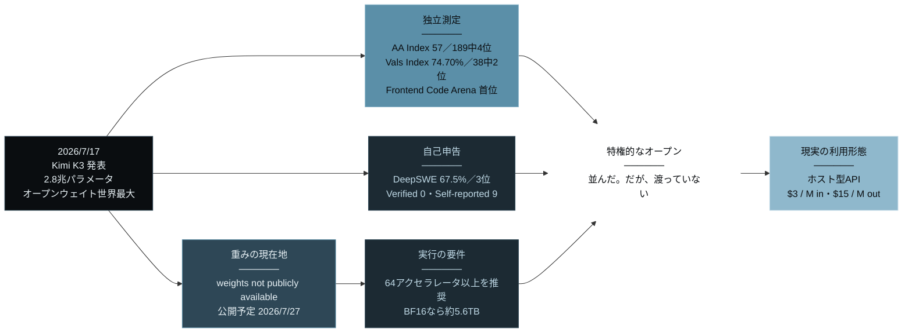
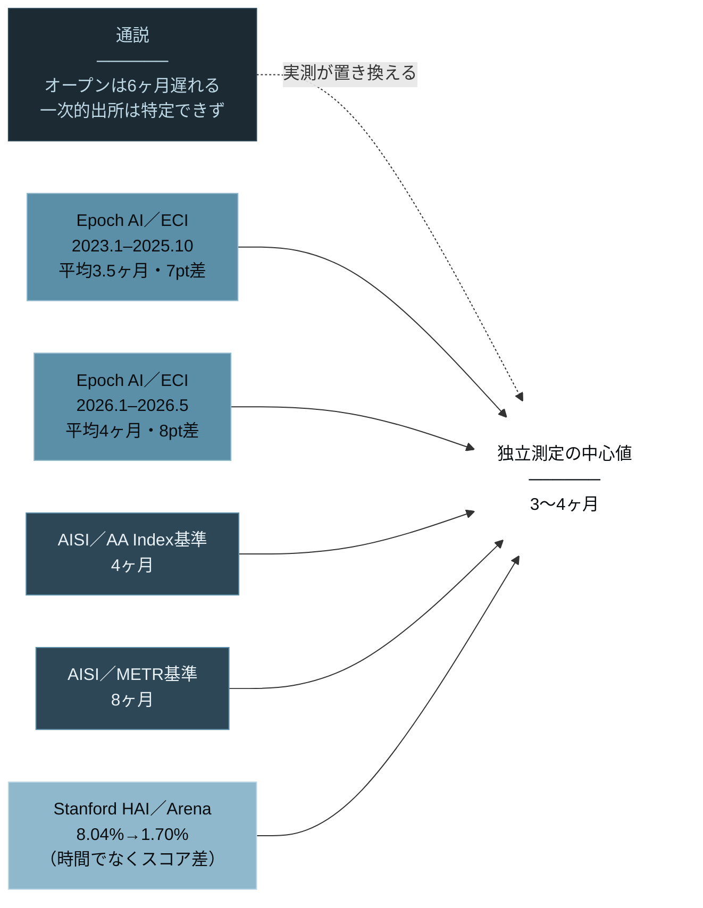
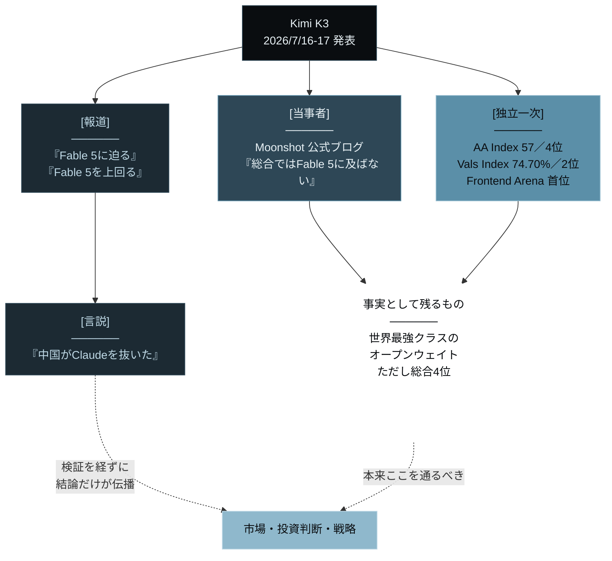
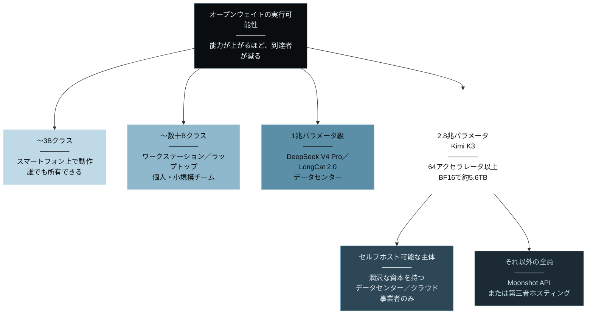
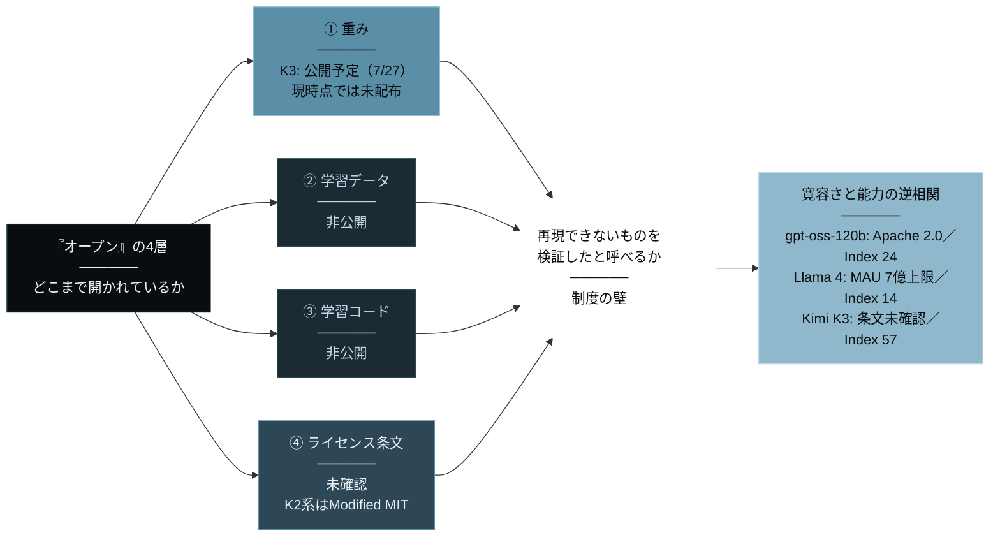
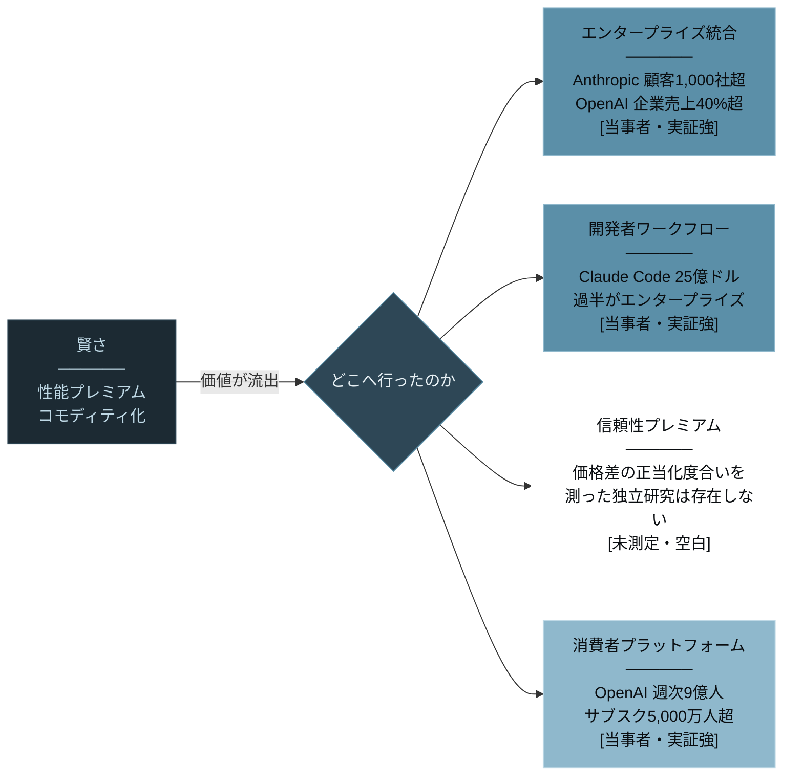
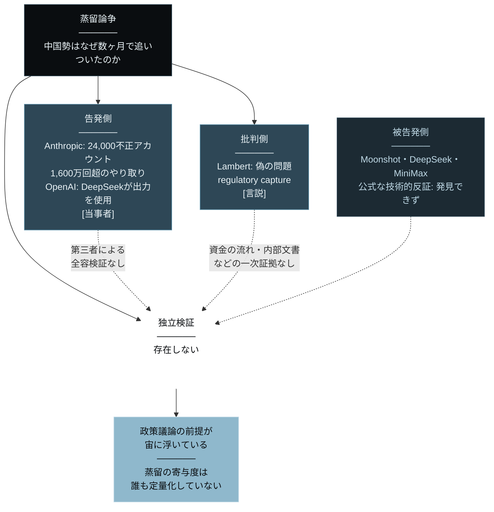
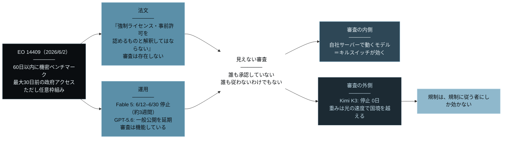
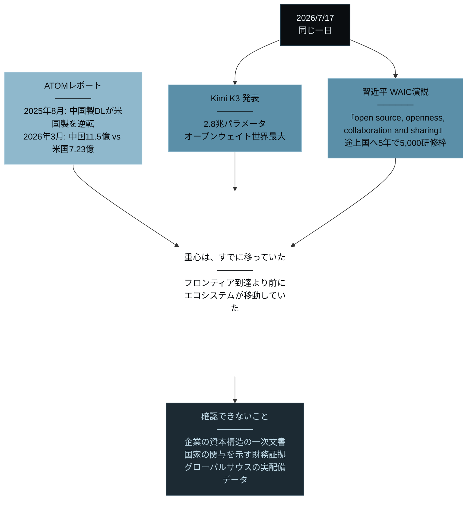

# Frontier-Grade Open Weights ── フロンティア級のオープンウェイトモデルは、開かれたのか

> **"They matched the frontier. But no one can hold them."**
> （フロンティアには、並んだ。だが、誰の手にも渡っていない）

 

---

# 序章: 開かれた、と誰もが言った日

2026年7月17日、北京。 
中国のAI企業・月之暗面（Moonshot AI）が、2兆8,000億パラメータの新モデル「Kimi K3」を発表した。 
学習済みモデルの中身を公開したオープンウェイト型としては、世界最大である。 
そしてロイターは、その性能を「アンソロピックの最先端モデル『フェイブル』に迫る」と報じた。

市場は、その日のうちに答えを出した。 
オープンウェイトがフロンティアに並んだという一文が、数千億ドルの前提を揺らした。 
だが、その日、もう一つの事実があった。

**重みは、公開されていなかった。**

独立評価機関Artificial Analysisは同時点でKimi K3を「**weights not publicly available**（重みは公開されていない）」と表示し、 
別の独立評価機関Vals AIに至っては、ライセンス種別を「**Proprietary（プロプライエタリ）— contact us to get access**」と記載していた。 
Moonshot自身の公式ブログが約束したのは、**2026年7月27日**に全重みを公開するという予定である。

世界最大のオープンウェイトモデルは、発表された日、まだオープンではなかった。 
本書は、この10日間の空白から始まる。

## 世界最大のオープンウェイトが、フロンティアに並んだ

まず、何が本当に起きたのかを確定させる。

独立機関Artificial Analysisの測定によれば、Kimi K3のIntelligence Indexは**57**、189モデル中**第4位**。 
上位にいるのはClaude Fable 5（60）とGPT-5.6 Sol（59）であり、 
K3はGPT-5.5・Claude Opus 4.8と**同等の水準**に着地した。 
別の独立機関Vals AIのVals Indexでは**74.70%（±0.96）**で、38モデル中**2位**。 
さらにArena.aiのFrontend Code Arena——人間がブラインドで優劣を選ぶ評価——では、**K3がClaude Fable 5を上回り首位**を取った。

ここで一点、正確を期す。 
「フェイブル5に迫る」「Opus 4.8とGPT-5.6 Solを大幅に上回る」という言葉のうち、 
**独立機関が測ったのは総合指数とアリーナ順位だけ**である。 
Moonshot自身のテクニカルブログは、 
GPUカーネル最適化などの自社コーディングベンチマークでOpus 4.8とGPT-5.6 Solを上回るとしつつ、 
**総合性能ではClaude Fable 5に及ばない**と自己評価している。 
つまり「超えた」と報じられている部分は、当事者自身が超えていないと書いている領域を含む。

自己申告と独立測定の境界は、もっと露骨な形でも現れる。 
DeepSWE Leaderboardでは、K3は67.5%で3位に掲載されている。 
だが同じページには、こう明記されている——**Verified 0 / Self-reported 9**。 
検証済みはゼロ件。掲載されている9件すべてが自己申告である。

なぜ、この区別にこだわるのか。 
この種の衝撃では、数字が独り歩きする。 
「中国のオープンモデルがClaudeを抜いた」という物語は分かりやすく、拡散しやすい。 
だが、独立測定が示しているのは「総合4位」であり、「特定ドメインでの首位」だ。 
本書は、熱狂に乗るためではなく、熱狂の**構造**を理解するために書かれている。 
だからこそ、最初の数字から正確であることにこだわる。

そして、正確であろうとしたとき、より重要な事実が現れる。 
**「オープンウェイトは6ヶ月遅れる」という通説は、すでに死んでいた。** 
独立研究機関Epoch AIの計測によれば、オープンとクローズドの能力差は、 
2023年1月から2025年10月までの平均で**3.5ヶ月**（ECI差7ポイント）、 
2026年1月から5月28日までで平均**4ヶ月**（ECI差8ポイント）である。 
Kimi K3は突然変異ではない。3年かけて詰められた距離の、到達点にすぎない。

だが、性能が並んだことと、それが手に渡ることは、別の話だ。 
2026年7月17日に起きたことを、一枚に整理する。

独立測定が届いた領域は明るく、自己申告と物理的制約は暗いまま残る。 
そして、すべての経路が一点に収束する。 
発表された日、世界最大のオープンウェイトモデルへの唯一の現実的な入口は、月之暗面のAPIだった。

## 本書が論じる「特権的なオープン」とは何か

では、フロンティアに並んだそのモデルを、あなたは動かせるのか。

Moonshotは公式ブログに、こう書いている。 
推論効率は大きな高帯域通信ドメインの恩恵を受けるため、**64アクセラレータ以上のスーパーノード構成での展開を推奨する**、と。 
2.8兆パラメータの重みは、BF16なら約5.6TB、INT8でも約2.8TB、INT4でも約1.4TBの保存容量を要する（総パラメータ数からの算術推計）。 
**ダウンロードできることと、動かせることは、別である。** 
大半のユーザーにとって、現実的な選択肢はホスト型API——つまり、月之暗面に課金することだけだ。 
入力$3/M、出力$15/M。オープンウェイトモデルは、有料APIとして売られている。

本書は、この状態を一語で捉える。「**特権的なオープン（Privileged Open）**」だ。

特権的なオープンとは、**重みが公開されるという意味では確かに開かれているが、 
それを保有し、動かし、改変する能力が一部の主体に集中したままである状態**を指す。 
誰も所有していない。だが、誰でも使えるわけでもない。 
公開は事実であり、到達は虚構である。

なぜ「オープンウェイト」という既存の語ではなく、あえて「特権的なオープン」と呼ぶのか。 
それは、この議論が「オープンか、クローズドか」の二項で語られる限り、 
**何が本当に移動したのかを永久に見誤る**からだ。 
移動したのは、モデルの所有権ではない。移動したのは、**希少性の在処**である。 
賢さは希少でなくなった。では、いま何が希少なのか。 
この一語に、本書のすべてが詰まっている。

| | 通説としての「オープン化」 | 特権的なオープン（本書の観測） |
|---|---|---|
| 重みの公開 | 公開＝誰でも入手できる | 公開は予定。入手と実行は別問題 |
| 実行環境 | ローカルで動く | 64アクセラレータ級のスーパーノード推奨 |
| 実質的な利用形態 | セルフホスト | ホスト型API（$3/$15）への課金 |
| 検証可能性 | 誰でも再現できる | 重み公開まで独立検証は不能 |
| ライセンス | オープンソース同等 | K3の正式条文は未確認 |
| 帰結 | 知能の民主化 | 知能の再集中 |

## 本書の読者と地図

本書は、次の3者のために書かれている。

* 第一に、**「中国のオープンモデルが来た。うちの戦略は変えるべきか」と問われている経営層・AI戦略責任者**。
変えるべき部分と、変えなくていい部分がある。データは、その線を明確に示している。

* 第二に、**AIラボという産業の行方に資本や職業人生を張っている投資家・事業開発者・エンジニア**。
「プロプライエタリは崩壊する」も「何も変わらない」も、どちらもデータに支持されていない。

* 第三に、**AIの規制と地政学を、報道の見出しではなく構造として理解したい人**。
米国のフロンティアは公開前に事実上の審査を通る。そして審査には、外側がある。

本書の地図はこうだ。 
まず、距離が縮み、そして安定したという事実を確定させる（第1章）。 
次に、その事実を誰が測ったのかを問い、測定そのものの壁を見る（第2章）。 
そして、公開されてなお渡らない理由を、**物理の壁**（第3章）と**制度の壁**（第4章）として解剖する。 
続いて、賢さが希少でなくなった後にAIラボが何を売っているのかを収益の一次データで検証し（第5章）、 
その最大の争点である蒸留が、**証拠の壁**に阻まれていることを示す（第6章）。 
最後に、**審査の壁**の外側で何が起きているのか（第7章）、 
そして開放が**国家の壁**を越える言語になった日（第8章）へ進む。

壁は、物質から言説へ、個人から国家へと拡大していく。 
だが、どの層でも同じ命題が反復される。 
フロンティアは、開かれた。だが「オープン」にはなっていない。 
この二つの文が同時に真である世界で、何が希少で、誰が勝つのか。 
一次データと構造から、順に解き明かしていく。

### 参考文献

1. ロイター「中国ＡＩの月之暗面が新モデル発表、『フェイブル』に迫る性能」（2026年7月17日）
2. Moonshot AI「Kimi K3 Tech Blog: Open Frontier Intelligence」（2026年7月16日）
   <https://www.kimi.com/blog/kimi-k3>
3. Artificial Analysis「Kimi K3 – Intelligence, Performance & Price Analysis」（weights not publicly available）
   <https://artificialanalysis.ai/models/kimi-k3>
4. Vals AI「Kimi K3」（Vals Index 74.70% ±0.96／38モデル中2位／License type: Proprietary）
   <https://www.vals.ai/models/kimi_kimi-k3>
5. LLM Stats「DeepSWE Leaderboard」（K3 67.5%・3位／Verified 0・Self-reported 9）
   <https://llm-stats.com/benchmarks/deepswe>
6. Epoch AI「Open-weight models lag state-of-the-art by around 3 months on average」（2025年10月30日）
   <https://epoch.ai/data-insights/open-weights-vs-closed-weights-models>
7. Epoch AI「Open models lag state-of-the-art closed models by 4 months」（2026年5月29日）
   <https://epoch.ai/data-insights/open-closed-eci-gap>

 

---

# 第1章: 6ヶ月は、3ヶ月になっていた

「オープンウェイトはフロンティアに追いついた」——2026年7月、この一文が世界を駆けた。 
だが、追いついたのなら、それまでどれだけ離れていたのか。

この問いに、多くの人は「半年」と答える。 
オープンウェイトモデルはプロプライエタリのフロンティアに約6ヶ月遅れる——業界の定型句である。 
では、その6ヶ月は、誰が測ったのか。

## 通説の出所を、誰も知らない

本書の調査では、「6ヶ月」という数字の一次的な出所を特定できなかった。 
広く流通し、記事に引用され、投資判断の前提にすらなっているが、 
それを厳密な方法論で測定した独立研究に行き着かない。

一方で、**測っている機関は存在する**。 
そして、その数字は6ヶ月ではない。

独立研究機関Epoch AIは、Epoch Capabilities Index（ECI）を用いてオープンとクローズドの能力差を継続測定している。 
2025年10月30日時点の公表値は、こうだ。 
**2023年1月から2025年10月までの平均ラグは3.5ヶ月、ECI差は7ポイント。**

さらに2026年5月29日の更新では、こうなっている。 
**2026年1月1日から5月28日までの平均ラグは4ヶ月、ECI差は8ポイント。** 
より厳格な基準を採れば6ヶ月。

つまり、通説の「6ヶ月」は、最も保守的な基準を採ったときの上限値だった。 
実測の中心値は、3〜4ヶ月である。 
**Kimi K3が現れる前から、距離はとうに縮んでいた。**

## 同じ現象を測って、答えが倍ちがう

ここでもう一つ、重要な事実がある。 
測定機関によって、答えが倍以上ちがうのだ。

英国のAI Security Institute（AISI）は2026年7月のFrontier AI Trends Reportで、こう整理している。 
**Artificial AnalysisのIntelligence Indexを基準にすれば4ヶ月。 
METRのtime-horizon tasksを基準にすれば8ヶ月。**

どちらも独立機関である。どちらも真剣に測っている。 
それでも、**何を能力と定義するかで、答えは倍ちがう。**

スタンフォードHAIのAI Index 2025は、また別の切り口を示す。 
Chatbot Arenaにおけるオープンとクローズドの差は、 
2024年1月の8.04%から、2025年2月には1.70%へ縮小した。 
これは時間の差ではなく、スコアの差である。

3つの独立機関が、3つの異なる指標で測り、3つの異なる数字を出す。 
だが、方向だけは一致している——**差は、年単位ではなく数ヶ月単位に縮んだ。**

## Kimi K3は、列の中の一つにすぎない

距離が縮んだのは、K3が特別だったからではない。 
2026年前半、フロンティア級を標榜するオープンウェイトが列をなして現れている。

* **DeepSeek V4 Pro**：1.6兆パラメータ／49Bアクティブ／100万トークン（2026年4月）
* **美団 LongCat 2.0**：1.6兆パラメータ／平均48Bアクティブ／100万トークン（2026年6月30日）。国産計算クラスタ上で学習から推論まで全工程を完遂したと公式に発表
* **MiniMax M3**：100万トークン・ネイティブマルチモーダル。「3つのフロンティア能力を持つ最初のオープンウェイトモデル」と自称
* **GLM-5.2**：Terminal-Bench 2.1で81.0、SWE-bench Proで62.1

そしてKimi K3が、2.8兆パラメータでその列の先頭に立った。 
アーキテクチャはStable LatentMoE——896のエキスパートのうち16のみがアクティブになる極端な疎性である。 
総パラメータ2.8兆に対し、アクティブは32B。わずか1.8%。 
巨大な知識量と推論効率を、疎性で両立させる設計だ。

対する米国側のオープンウェイトはどうか。 
OpenAIのgpt-oss-120bはApache 2.0という真に寛容なライセンスで公開されているが、 
117Bパラメータ（5.1Bアクティブ）、Artificial AnalysisのIntelligence Indexは24。 
MetaのLlama 4 Maverickは402B／17Bアクティブ、100万トークン、Index 14。

Kimi K3が57、Fable 5が60、GPT-5.6 Solが59という座標に置けば、風景は明白だ。 
**争点は「米国にオープンウェイトがない」ことではない。 
「米国のオープンウェイトが、フロンティア級オープンウェイトの主役ではなくなった」ことだ。**

## 距離は縮み、そして安定した

ここまでの事実を、一つの命題に畳む。

**オープンとクローズドの距離は、3年かけて縮み、そして数ヶ月という水準で安定した。**

驚くべきは、Kimi K3が到達したことではない。 
驚くべきは、**誰も正確な距離を知らないまま、6ヶ月という数字で議論していた**ことだ。 
通説は測定に置き換わった。そして測定は、通説より短い数字を出した。

だが、ここで満足してはいけない。 
Epoch AIもAISIもスタンフォードHAIも、独立して測った機関である。 
では、Kimi K3そのものについて流通している数字は、誰が測ったのか。

次章では、その問いを立てる。

### 参考文献

1. Epoch AI「Open-weight models lag state-of-the-art by around 3 months on average」（2025年10月30日・2023年1月–2025年10月の平均3.5ヶ月／ECI差7ポイント）
   <https://epoch.ai/data-insights/open-weights-vs-closed-weights-models>
2. Epoch AI「Open models lag state-of-the-art closed models by 4 months」（2026年5月29日・2026年1月–5月28日の平均4ヶ月／ECI差8ポイント／厳格基準なら6ヶ月）
   <https://epoch.ai/data-insights/open-closed-eci-gap>
3. UK AI Security Institute「Frontier AI Trends Report」（2026年7月・AA Index基準4ヶ月／METR time-horizon基準8ヶ月）
   <https://www.aisi.gov.uk/frontier-ai-trends-report>
4. Stanford HAI「Technical Performance｜The 2025 AI Index Report」（Chatbot Arena差 2024年1月8.04%→2025年2月1.70%）
   <https://hai.stanford.edu/ai-index/2025-ai-index-report/technical-performance>
5. Moonshot AI「Kimi K3 Tech Blog」（2.8兆総パラメータ／32Bアクティブ／Stable LatentMoE 896エキスパート中16／Kimi Delta Attention／100万トークン）
   <https://www.kimi.com/blog/kimi-k3>
6. DeepSeek「DeepSeek-V4-Pro」（1.6兆／49Bアクティブ／100万トークン）
   <https://huggingface.co/deepseek-ai/DeepSeek-V4-Pro>
7. 美団技術団队「LongCat-2.0 正式发布」（2026年6月30日・1.6兆／平均48Bアクティブ／国産算力クラスタで全工程完遂）
   <https://tech.meituan.com/2026/06/30/LongCat2.0.html>
8. MiniMax「MiniMax M3」
   <https://www.minimax.io/models/text/m3>
9. zai-org「GLM-5」（Terminal-Bench 2.1 81.0／SWE-bench Pro 62.1）
   <https://github.com/zai-org/GLM-5>
10. OpenAI「Introducing gpt-oss」（Apache 2.0／117B・5.1Bアクティブ）
    <https://openai.com/index/introducing-gpt-oss/>
11. Artificial Analysis「Llama 4 Maverick」（402B・17Bアクティブ／Index 14）
    <https://artificialanalysis.ai/models/llama-4-maverick>

 

---

# 第2章: その数字は、誰が測ったのか

Kimi K3について、いま世界に流通している数字がある。 
Terminal-Bench 2.1。GPQA-Diamond。DeepSWE。GPUカーネル最適化での優位。 
これらの数字は、誰が測ったのか。

答えは単純だ。**大半は、Moonshot自身である。**

## 5つの分類が、風景を変える

本書は、すべての数値と主張を5つに分類する。

| 分類 | 定義 | 例 |
|---|---|---|
| **[独立一次]** | 学術論文、独立評価機関、公的機関、政府文書 | Epoch AI、Artificial Analysis、Vals AI、AISI、大統領令本文 |
| **[当事者]** | 測定対象の企業自身の発表・自己申告ベンチマーク | Moonshot公式ブログ、Anthropic公式リリース |
| **[利害関係者]** | その数字が有利に働く立場からの発信 | VC調査、投資先を持つ機関の市場推計 |
| **[報道]** | 一次資料を取材した報道機関 | ロイター、Tom's Hardware |
| **[言説]** | 一次データを伴わない意見・予測 | ブログ、アナリスト論考 |

この分類を通すと、Kimi K3の風景は変わる。

**[独立一次]で確認できたもの**は、次の4つだけだ。

* Artificial Analysis：Intelligence Index **57**、189モデル中**4位**。上位はFable 5が60、GPT-5.6 Solが59
* Vals AI：Vals Index **74.70%（±0.96）**、38モデル中**2位**
* Arena.ai（Frontend Code Arena）：Fable 5を上回り**首位**
* Artificial Analysis／Vals AI：**重みは未公開／ライセンスはProprietary表示**

**[当事者]にとどまるもの**は、それ以外のほぼすべてである。

* 2.8兆パラメータ、32Bアクティブ、896エキスパート中16アクティブ、Kimi Delta Attention
* GPUカーネル最適化ベンチマークでOpus 4.8・GPT-5.6 Solを上回るという主張
* 64アクセラレータ以上を推奨するという展開要件
* 7月27日に全重みを公開するという予定
* API価格 $3/$15（キャッシュヒット時の入力$0.30）

そして最も象徴的なのが、DeepSWE Leaderboardである。 
K3は67.5%で3位に掲載されている。 
だが同じページに、こう書かれている——**Verified 0 / Self-reported 9**。 
9件の掲載すべてが自己申告で、検証済みはゼロ。 
**リーダーボードに載っていることと、検証されていることは、別である。**

## 当事者自身が、超えていないと書いている

ここで、興味深い逆転が起きている。

Moonshotのテクニカルブログは、GPUカーネル最適化などの自社ベンチマークで優位を主張する一方、 
**総合性能ではClaude Fable 5に及ばない**と自己評価している。 
つまり「K3がFable 5を超えた」と最も強く言っているのは、Moonshotではない。 
**報道と、その先の言説である。**

独立測定はこれを裏づける。 
Artificial AnalysisとVals AIの数字は、K3を「フロンティア近傍にいる世界最強クラスのオープンウェイト」と位置づけるが、 
「フロンティアを凌駕した存在」とは位置づけていない。 
Frontend Code Arenaでの首位は事実だが、それは**Webインターフェース構築という特定タスク**の話だ。

**特定タスクでの首位を、総合での逆転として読む。** 
これが、2026年7月に起きた最大の誤読である。

## 検証不能なものを、検証したと呼ばない

もう一つ、決定的な事実がある。 
本書の調査では、**独立した第三者が自前の環境にK3の完全な重みを展開し、 
推論コスト、実効VRAM消費、レイテンシを厳密に測定したレポートは、一件も発見できなかった。**

理由は単純だ。**重みが、まだ配布されていないからである。** 
7月27日の公開まで、ハードウェアレイヤーでの独立検証は物理的に不可能だ。

つまり、いま流通しているK3の実務評価はすべて、 
①Moonshotの自己申告か、②Moonshotが運営するAPI経由での測定か、 
そのどちらかに依存している。

**API経由の測定は、モデルの測定ではない。 
モデルと、それを提供する事業者の運用の、合成物の測定である。**

これは些細な区別ではない。 
量子化の設定、バッチング、ルーティング、キャッシュ——APIの向こう側で何が起きているかを、外部は知り得ない。 
重みを手にして初めて、それはモデルの測定になる。

## 測定の未成熟が、この産業の実像である

第1章で見た通り、同じ現象を測って機関ごとに倍の差が出る。 
本章で見た通り、リーダーボードの掲載は検証を意味しない。 
そして、最も基礎的な検証——重みを手にして動かすこと——は、まだ誰にもできていない。

**この産業は、自分が何を作ったのかを、正確に測る手段をまだ持っていない。**

それでも、数字は動く。 
投資が動き、戦略が動き、規制の議論が動く。 
検証不能な数字が、検証されないまま前提になる。

だから本書は、以降のすべての章で分類を明示する。 
誰が測ったのか。その人は、その数字が大きいと得をするのか。 
**この二つを問い続けることが、いまこの領域で唯一可能な誠実さである。**

次章では、その誠実さを最も過酷な事実に向ける。 
仮に7月27日に重みが公開されたとして、あなたはそれを動かせるのか、という問いだ。

### 参考文献

1. Artificial Analysis「Kimi K3 – Intelligence, Performance & Price Analysis」（Intelligence Index 57／weights not publicly available）
   <https://artificialanalysis.ai/models/kimi-k3>
2. Artificial Analysis「AI Model & API Providers Analysis」（Fable 5 = 60／GPT-5.6 Sol = 59／Kimi K3 = 57）
   <https://artificialanalysis.ai/>
3. Vals AI「Kimi K3」（Vals Index 74.70% ±0.96／38モデル中2位／License type: Proprietary）
   <https://www.vals.ai/models/kimi_kimi-k3>
4. LLM Stats「DeepSWE Leaderboard」（K3 67.5%・3位／**Verified 0 / Self-reported 9**）
   <https://llm-stats.com/benchmarks/deepswe>
5. Moonshot AI「Kimi K3 Tech Blog: Open Frontier Intelligence」（自社ベンチでの優位主張と、総合ではFable 5に及ばないとの自己評価）
   <https://www.kimi.com/blog/kimi-k3>
6. Tom's Hardware「China's 2.8-trillion-parameter Kimi K3 beats Claude Fable 5 in Frontend Code Arena benchmark」（2026年7月）
   <https://www.tomshardware.com/tech-industry/artificial-intelligence/moonshot-releases-2-8-trillion-parameter-kimi-k3>

 

---
# 第3章: 1.7テラバイトの、開かれた扉

「オープンウェイト」という語には、一つの約束が含まれている。 
誰でもダウンロードして、自分の環境で動かせる、という約束だ。 
その約束は、2.8兆パラメータの前で崩れる。

## 64という数字

Moonshotの公式ブログには、こう書かれている。 
推論効率は大きな高帯域通信ドメインの恩恵を受けるため、 
**64基以上のアクセラレータで構成されるスーパーノードでの展開を推奨する**、と。

これは高性能を追求するための贅沢な推奨ではない。 
**最低要件に近い現実である。** 
しかもMoonshotは、SFT（教師ありファインチューニング）の段階から 
量子化（MXFP4ウェイト／MXFP8アクティベーション）を実装している。 
つまり、**すでに圧縮した状態で、なお64基**なのだ。

重みの物理的な大きさを、総パラメータ数から算術的に見積もる。 
BF16なら約**5.6TB**。INT8でも約**2.8TB**。INT4まで攻めても約**1.4TB**。 
これはMoonshotが公表した総パラメータ数からの推計であり、 
MoEの全エキスパートをどう保持するか、公式がどの量子化を許容するかで必要構成は変わる。 
だが、変わらないことが一つある。 
**民生用GPU一枚で動くという類いの話ではない。**

## 疎性は、要求を減らさない

ここで一つの誤解を解いておく。 
K3のアーキテクチャは896のエキスパートのうち16のみをアクティブにする。 
アクティブパラメータは32B——総数のわずか1.8%である。 
「だから軽いのでは」と考えるのは自然だ。

だが、疎性が減らすのは**計算量**であって、**メモリフットプリント**ではない。 
どのエキスパートが呼ばれるかは入力次第だから、**896すべてを手元に置いておく必要がある。** 
計算は速い。だが、置き場所は依然として1.4〜5.6TBだ。

疎性は、推論を安くする技術であって、参入を安くする技術ではない。

## 私が書いた命題が、ここで壊れる

私は2026年3月1日、『The Edge of Intelligence』という書籍を公開した。 
その中核命題はこうだ——**オンデバイスAIの限界費用はゼロである。** 
月額20ドルのサブスクリプションは、自分のデバイスで無料で動くAIの前では「なくても困らない贅沢」に変質する。 
だから消費者は、不可逆にオンデバイスへ移行する。

この命題は、**Nanbeige 4.1 3Bのような小型モデルでは真である。** 
そしてKimi K3では、**偽である。**

限界費用がゼロになるのは、重みを自分の環境に置けたときだけだ。 
置けなければ、限界費用は月之暗面が決める。 
入力$3/M、出力$15/M——これはGPT-5.6 Terra級の価格帯であり、**格安ではない。**

**オープンウェイトは、一枚岩ではない。** 
実行可能性によって階層化しており、上の階層ほど能力が高く、到達者が少ない。 
そして2026年7月、フロンティアに並んだのは**最上層**だった。 
民主化が進んだ層と、フロンティアに届いた層は、別の層である。

自分の書いた命題を、自分で壊しておく。 
それが、一次情報で書くということの最低限の作法だと考えている。

## 「安い」は、どこにあるのか

ただし、価格の風景全体を見ると、別の事実も現れる。 
Artificial Analysisのcost-per-task比較（2026年7月）は、こうだ。

| モデル | タスクあたりコスト | 分類 |
|---|---|---|
| Claude Fable 5 | **$2.75** | プロプライエタリ |
| GPT-5.6 Sol | **$1.04** | プロプライエタリ |
| **Kimi K3** | **$0.94** | オープンウェイト（予定） |
| GLM-5.2 | **$0.47** | オープン系 |
| DeepSeek V4 Pro | **$0.04** | オープンウェイト |
| Llama 4 Maverick | **$0.03** | オープン系 |

K3はFable 5の約3分の1だが、DeepSeek V4 Proの**23倍**である。 
「オープンウェイト＝安い」ではない。 
**オープンウェイトの中に、フロンティア級プレミアムが発生している。**

これが特権的なオープンの経済的な顔だ。 
重みを公開すると宣言しながら、その能力への現実的なアクセスは有料APIで売る。 
DeepSeekは$0.04で売り、K3は$0.94で売る。 
両者とも「オープンウェイト」を名乗る。**同じ語が、23倍の価格差を覆っている。**

## 重みが出ても、すぐには使えない

物理の壁は、公開の瞬間に消えるわけではない。 
**時間として、公開の後にも残り続ける。**

これまで、中国のオープンウェイトモデルには一つの型があった。 
RLの学習が終わると、数時間から、遅くとも1週間以内に重みが公開される。 
そしてエコシステムは、それをどう動かすかを即座に理解していた。 
推論エンジンへのパッチは、公開の数日前から準備されていることさえある。

Kimi K3では、この型が成立しない可能性が高い。

Interconnectsの対談で、Florian Brandはこう述べている。 
**このモデルは、重みをロードするだけでB300のノードが1台必要になる。** 
ファインチューニング可能な状態に持っていくには、相当なエンジニアリングと時間を要する、と。

Nathan Lambertは、これを時間差の問題として捉え直している。 
クローズドなラボは、発表前にこの最適化を裏側で済ませてから世に出す。 
つまり彼らは、**性能差として観測される時間を、意図的に操作している。** 
オープンウェイト支持者は長らく、「クローズドモデルが利用可能になった時点からしか時間差は測れない」と主張してきた。

だが、いま同じ力学がオープン側にも生まれている。 
**重みが出ることと、それが使えるようになることの間に、1ヶ月規模の隔たりが生じうる。** 
現に、Kimiの推論APIは需要に供給が追いつかず、機能不全に陥っている。 
モデルは公開されたのに、拡散していない。

ここに、本書の命題の実務的な帰結がある。 
**公開日と、到達日は、別の日付である。** 
そして両者の間隔を決めるのは、ライセンスでも政治でもなく、**そのモデルを動かせる設備を持っているかどうか**だ。

64基のアクセラレータを買える組織にとって、その間隔は短い。 
買えない組織にとって、その間隔は事実上、無限である。

## 開かれた扉と、その重さ

7月27日、重みは公開されるかもしれない。 
扉は開く。誰でも入っていいと言われる。

だが、扉の向こうにあるのは1.4〜5.6テラバイトの質量であり、 
64基のアクセラレータであり、それを買える資本である。 
**開放は、能力の配布を意味しない。**

物理の壁は、悪意でも陰謀でもない。 
ただそこにある。誰も止めていないのに、誰も通れない。 
これが、特権的なオープンの第一の顔だ。

次章では、第二の顔を見る。 
扉が開いたとして、**どの条件で入っていいのかを、まだ誰も知らない**という事実である。

### 参考文献

1. Moonshot AI「Kimi K3 Tech Blog: Open Frontier Intelligence」（64アクセラレータ以上のスーパーノード推奨／MXFP4ウェイト・MXFP8アクティベーション／Stable LatentMoE 896エキスパート中16アクティブ／API $3・$15、キャッシュヒット時入力$0.30）
   <https://www.kimi.com/blog/kimi-k3>
2. Artificial Analysis「gpt-oss-120b – Intelligence, Performance & Price Analysis」（cost-per-task比較：Fable 5 $2.75／GPT-5.6 Sol $1.04／Kimi K3 $0.94／GLM-5.2 $0.47／DeepSeek V4 Pro $0.04／Llama 4 Maverick $0.03）
   <https://artificialanalysis.ai/models/gpt-oss-120b>
3. Nathan Lambert & Florian Brand（Interconnects）「Open models recap: more on Kimi K3, Qwen 3.8, Xi's WAIC speech, distillation, the open-closed gap, and what's next」（2026年7月22日・重みのロードだけでB300ノード1台／ファインチューニング可能化に相当な工数／Kimi APIは需要過多で機能不全）
   <https://www.interconnects.ai/p/open-models-recap-more-on-kimi-k3>
4. Satoshi Yamauchi「The Edge of Intelligence — AIがあなたのデバイスで動く時代」（Leading.AI・CC BY 4.0）
   <https://github.com/Leading-AI-IO/edge-ai-intelligence>
5. MarkTechPost「Moonshot AI Releases Kimi K3: A 2.8 Trillion Parameter Open MoE Model With Kimi Delta Attention and 1M Context」（2026年7月16日）
   <https://www.marktechpost.com/2026/07/16/moonshot-ai-releases-kimi-k3-a-2-8-trillion-parameter-open-moe-model-with-kimi-delta-attention-and-1m-context/>

※重みサイズ（BF16 約5.6TB／INT8 約2.8TB／INT4 約1.4TB）は、Moonshotが公表した総パラメータ数2.8兆からの算術推計であり、公式が開示した数値ではない。

 

---

# 第4章: ライセンスなき公開

2026年7月18日時点で、Kimi K3について確認できないことがある。 
**どの条件で使っていいのか、である。**

## 独立評価機関の台帳では、Proprietaryだった

独立評価機関Vals AIのKimi K3ページには、こう記載されていた。 
**License type: Proprietary（contact us to get access）**。

Artificial Analysisは「**weights not publicly available**」と表示していた。

世界最大のオープンウェイトモデルが、 
発表から二日経っても、独立機関のデータベース上ではプロプライエタリだった。 
これは皮肉ではなく、**配布状態を外から観察している第三者の、正確な記録**である。

ここで、独立性の序列を明確にしておく。 
Moonshotの発表は「オープンにする」という**意思**の表明だ。 
Vals AIとArtificial Analysisの表示は「まだ配布されていない」という**状態**の観測だ。 
**意思より、状態のほうが強い。**

## 前例はあるが、条文はない

本書の調査では、**K3の正式なライセンス全文を発見できなかった。** 
再配布条件も、軍事利用制限の有無も、修正版の公開義務も、確認できていない。

見つかったのは、前世代の条文だけである。 
Kimi K2系のライセンスは**Modified MIT**であり、 
**月間アクティブユーザー1億人超、または月間収益2,000万ドル超**の商用サービスでは、 
UI上に「Kimi K2 / K2.5」と明示する義務が発動する。

一部の専門メディアは、K3も同じModified MITだと報じている。 
だが、それは前例からの推定であって、条文の確認ではない。 
**K2がModified MITだったことは、K3がModified MITであることを保証しない。**

なぜこれが重要か。 
ライセンスは、「オープンウェイトが産業を壊す力」の大きさを直接決めるからだ。 
商用利用が自由か。再配布が自由か。軍事利用の制限があるか。修正版の公開義務があるか。 
**この4つの組み合わせ次第で、同じ重みが、まったく違う戦略資産になる。**

## 「オープンウェイト」は「オープンソース」ではない

ここで、語の定義を確定させる。

**オープンソース**とは、ソフトウェアの設計図が公開され、誰でも再現・改変・再配布できる状態を指す。 
**オープンウェイト**とは、**学習済みパラメータのファイルだけ**が公開された状態を指す。

Kimi K3で公開が予定されているのは、後者である。 
学習パイプラインは公開されない。 
アーキテクチャの完全なソースコードも公開されない。 
**学習データそのものは、公開されない。**

これを「オープンソース」とみなす学術的・技術的な合意は、形成されていない。 
さらにModified MITのような閾値条項（MAU 1億人／月商2,000万ドル）は、 
**無条件の再配布と商用利用を認めるOSI（Open Source Initiative）の定義から逸脱する。**

Metaも同じ構造を持つ。 
Llama 4 Community Licenseには**MAU 7億人**という上限がある。 
真に寛容なのは、OpenAIのgpt-oss-120bのApache 2.0だ。 
**そして、そのgpt-oss-120bのIntelligence Indexは24である。**

**寛容さと能力は、いま逆相関している。** 
最もオープンなライセンスを持つモデルは、フロンティアから最も遠い。 
最もフロンティアに近いオープンウェイトは、ライセンスすら開示していない。

## 6日間で、事実基盤が一斉に更新される

本書が書かれている2026年7月18日から、わずか6日のうちに、三つのことが起きる。

* **7月27日**：Moonshotが予告した全重みの公開日。ここで初めて、第三者による独立検証が可能になる
* **8月1日**：米国大統領令（EO 14409）の60日期限。NSA等による「対象フロンティアモデル」の基準が具体化する
* **8月2日**：EU AI ActのGPAI義務について、**執行権限が発効する**

つまり本書は、**構造が確定する直前に、構造を書いている。** 
これは弱点ではない。 
6日後に何が確定し、何が確定しないかを、いま言語化しておくことにこそ意味がある。 
確定した後で書けば、それは解説になる。確定する前に書けば、それは検証可能な予測になる。

本書の予測はこうだ。 
**7月27日に重みが公開されても、特権的なオープンは解消しない。** 
64アクセラレータ要件は残る。1.4〜5.6TBの質量は残る。 
そしてライセンスに閾値条項が入っていれば、大規模な商用利用ほど条件が付く。 
**解消するのは検証不能性だけであり、到達不能性ではない。**

## 誰も鍵をかけていない。だが、誰も入れない

物理の壁（第3章）と制度の壁（本章）は、同じ一つのことを別の角度から言っている。

**開放は、宣言でも意思でもなく、状態である。** 
そして状態としての開放には、重みの配布だけでなく、 
実行できる資源と、使ってよい条件と、再現できる材料が要る。 
Kimi K3は、いまその4つのうち1つも揃っていない。**予定されているだけである。**

次章では、視点を変える。 
仮に、すべてが揃ったとしよう。重みが配られ、条件が明示され、誰かが動かせるとしよう。 
そのとき、**AIラボは何を売って生きているのか。**

### 参考文献

1. Vals AI「Kimi K3」（**License type: Proprietary — contact us to get access**）
   <https://www.vals.ai/models/kimi_kimi-k3>
2. Artificial Analysis「Kimi K3」（**weights not publicly available**）
   <https://artificialanalysis.ai/models/kimi-k3>
3. Moonshot AI「Kimi-K2 LICENSE」（Modified MIT／MAU 1億人超または月商2,000万ドル超で帰属表示義務）
   <https://github.com/moonshotai/Kimi-K2/blob/main/LICENSE>
4. OpenAI「Introducing gpt-oss」（Apache 2.0）
   <https://openai.com/index/introducing-gpt-oss/>
5. Artificial Analysis「Llama 4 Maverick」（Llama 4 Community License／Index 14）
   <https://artificialanalysis.ai/models/llama-4-maverick>
6. The White House「Promoting Advanced Artificial Intelligence Innovation and Security」（2026年6月2日・発効後60日＝2026年8月1日前後に基準策定）
   <https://www.whitehouse.gov/presidential-actions/2026/06/promoting-advanced-artificial-intelligence-innovation-and-security/>
7. European Commission「Guidelines for providers of general-purpose AI models」（GPAI義務は2025年8月2日適用開始／**2026年8月2日から執行権限が発効**）
   <https://digital-strategy.ec.europa.eu/en/policies/guidelines-gpai-providers>

※K3の正式ライセンス全文・再配布条件・軍事利用制限・修正版公開義務は、本書の調査時点（2026年7月18日）では確認できなかった。「Modified MIT」とする報道は存在するが、確認できたのはK2系の条文のみである。

 

---
# 第5章: 賢さが売り物でなくなった日

性能プレミアムは崩れた。 
オープンウェイトはフロンティアの数ヶ月後ろまで来た。 
推論価格は、Epoch AIの推計で**年9倍から900倍、中央値で年50倍**のペースで下落している。

では、プロプライエタリのAIラボは、もう終わりなのか。

**データは、それを支持していない。**

## 470億ドルは、賢さの対価ではない

Anthropicの公式開示を時系列で並べる。

* **2026年2月12日**：Series Gで300億ドルを調達、ポストマネー評価額3,800億ドル。**run-rate revenue 140億ドル**。成長の主因は「enterprises and developers」と明記
* **同日**：**Claude Code単体でrun-rate 25億ドル**。しかも**その過半がエンタープライズ**
* **2026年4月16日**：2025年末の約90億ドルから、**300億ドル超**へ。年間100万ドル超の顧客は500社超から**1,000社超**へ
* **2026年5月28日**：Series Hで650億ドルを調達、ポストマネー評価額9,650億ドル。**run-rate 470億ドル**を突破

OpenAIも同様の構造を開示している（2026年3月31日）。 
**月商20億ドル。週次アクティブ9億人。サブスクリプション加入者5,000万人超。 
そして——企業売上が全体の40%超。** 
同社は、企業部門が2026年末に消費者部門と並ぶ見込みだと公式に述べている。

これらはすべて[当事者]の開示である。 
第三者監査を経た財務諸表ではない。 
だが、少なくとも一つのことは、この一次資料から確実に読み取れる。

**AIラボの収益の中心は、すでに「最も賢いモデルへのアクセス」ではない。** 
エンタープライズ導入。開発者ワークフロー。クラウド配備。営業と統合支援。 
Claude Codeが独立した25億ドルの収益柱になり、その過半が企業契約であるという事実は、 
**賢さではなく、賢さを業務に埋め込む仕組みが売れている**ことを示している。

## エンタープライズは、まだclosedを選んでいる

Menlo Venturesの調査（2025年12月9日）によれば、 
エンタープライズのLLM支出シェアは**Anthropic 40%、OpenAI 27%、Google 21%、そしてオープンソース系 11%**。

ここで正確を期す。 
**Menloはベンチャーキャピタルであり、[利害関係者]である。** 
AI企業への投資ポートフォリオを持つ主体が発表する市場推計を、独立一次情報として扱ってはならない。

それでも、この数字はOpenAI・Anthropicの一次開示と整合する。 
企業向け売上が伸び、企業向け顧客数が倍増し、企業がClaude Codeに金を払っている—— 
その裏側で、**企業の支出の89%がclosed側に向かっている**という構図は、矛盾なく成立する。

Menloの報告は、その理由にも触れている。 
IT・データサイエンスのような業務領域では、**reliability（信頼性）とdeep integrations（深い統合）が、speedより重要**だと。

つまり、**プレミアムの根拠が「一番賢いから」から「社内導入が楽で、信頼でき、監査に耐えるから」へ移った可能性が高い。**

## だが、その「信頼性プレミアム」は、測られていない

ここで、本書は立ち止まらなければならない。

**「信頼性」「安全性認証」「統合支援」が、平均して何%の価格差を正当化するのか—— 
それを直接測定した独立研究を、本書の調査では発見できなかった。**

あるのは市場推計（[利害関係者]）と、企業の自己申告（[当事者]）だけである。 
「信頼性プレミアム」は、いま最も広く語られ、**最も測られていない概念**の一つだ。

同じことが、因果についても言える。 
推論価格の下落は事実だ（Epoch AI・[独立一次]）。 
競争激化も事実だ。 
だが、**「Kimi K3やDeepSeekの登場が、直接OpenAI/Anthropicの値付けを下げた」と独立に特定した研究は、存在しない。** 
言えるのは、価格は下がった、競争は激しい、**そして因果分解は未解明である**、というところまでだ。

図の中で最も白いノードが、最も実証の薄い箇所である。 
**この産業が最も頼りにしている命題が、最も測られていない。**

## オープンでありながら、高く売る

もう一つ、興味深い交差がある。

Kimi K3は入力$3／出力$15で売られている。**Claude Sonnet級の価格帯**である。 
一方、DeepSeek V4 Proは入力$0.435／出力$0.87。**約7〜17分の1**だ。 
両者とも「オープンウェイト」を名乗る。

同じ週、Anthropicは自社の最上位モデルを従量課金へ移した。 
**プロプライエタリは定額の終わりへ向かい、オープンウェイトは有料APIへ向かう。** 
両者が、価格という一点で交差している。

欧州のMistralはこの構造を最も明示的に採っている。 
Mistral Medium 3.5は2026年4月28日時点で**Modified MITのオープンウェイト**として公式ドキュメントに記載されている一方、 
同社はプロプライエタリAPIとLe Chat Enterpriseを並行して運営している。 
**「オープンからクローズドへ一方向に転換した」のではない。 
最初から、両方を同時に持つ設計である。**

これが、K3の価格が示す構造だ。 
オープン化は**マインドシェア獲得の手段**であり、収益は**ホスティング環境で回収**する。 
重みを配ることと、金を取ることは、矛盾しない。

## 崩壊しない。だが、売り物が変わる

本章の結論を、二つの否定で示す。

**「プロプライエタリは崩壊する」——データは支持しない。** 
Anthropicのrun-rateは470億ドル。顧客1,000社超。OpenAIは月商20億ドル。 
エンタープライズ支出の89%が依然closed側にある（[利害関係者]推計だが一次開示と整合）。

**「何も変わらない」——データはもっと支持しない。** 
推論価格は年50倍（中央値）で下落している。 
オープンウェイトはフロンティアの4ヶ月後ろまで来た。 
そして企業自身が、賢さではなく統合と信頼性を売っていると開示している。

起きるのは崩壊ではない。 
**閉じたモデルが売るものが、能力から運用保証へ変わる**ことだ。

次章では、この転換の最大の争点に踏み込む。 
**中国勢の性能は、盗まれたものなのか。**

### 参考文献

1. Anthropic「Anthropic raises $30 billion in Series G funding at $380 billion post-money valuation」（2026年2月12日・run-rate 140億ドル／Claude Code run-rate 25億ドル・過半がエンタープライズ／成長はenterprises and developers主導）
   <https://www.anthropic.com/news/anthropic-raises-30-billion-series-g-funding-380-billion-post-money-valuation>
2. Anthropic「Anthropic expands partnership with Google and Broadcom for multiple gigawatts of next-generation compute」（2026年4月16日・2025年末約90億→300億ドル超／100万ドル超顧客500社超→1,000社超）
   <https://www.anthropic.com/news/google-broadcom-partnership-compute>
3. Anthropic「Anthropic raises $65B in Series H funding at $965B post-money valuation」（2026年5月28日・**run-rate 470億ドル**）
   <https://www.anthropic.com/news/series-h>
4. OpenAI「OpenAI raises $122 billion to accelerate the next phase of AI」（2026年3月31日・月商20億ドル／週次9億人／サブスク5,000万人超／**企業売上40%超**／2026年末に消費者と並ぶ見込み）
   <https://openai.com/index/accelerating-the-next-phase-ai/>
5. Menlo Ventures「2025: The State of Generative AI in the Enterprise」（2025年12月9日・Anthropic 40%／OpenAI 27%／Google 21%／**open-source 11%**／reliabilityとdeep integrationsがspeedより重要）※[利害関係者]
   <https://menlovc.com/perspective/2025-the-state-of-generative-ai-in-the-enterprise/>
6. Epoch AI「LLM inference prices have fallen rapidly but unequally across tasks」（2025年3月12日・**年9倍〜900倍下落／中央値50倍/年**／2024年以降加速）
   <https://epoch.ai/data-insights/llm-inference-price-trends>
7. Mistral AI「Mistral Medium 3.5 – Model Card」（2026年4月28日・**Modified MITのopen weights**）
   <https://docs.mistral.ai/models/model-cards/mistral-medium-3-5-26-04>
8. Mistral AI「Medium is the new large.」（プロプライエタリAPI／Le Chat Enterpriseの並行運営）
   <https://mistral.ai/news/mistral-medium-3/>

※OpenAI・Anthropicとも、API／サブスクリプション／エンタープライズ契約の厳密な三分割比率は開示していない。「信頼性プレミアムが何%の価格差を正当化するか」を直接測定した独立研究も、本調査では発見できなかった。

 

---

# 第6章: 蒸留という、証明されていない告発

中国のオープンウェイトが、なぜ数ヶ月でフロンティアに追いついたのか。 
この問いに対する最も強力な説明が、いま一つある。

**盗んだからだ、というものである。**

## 24,000のアカウントと、1,600万回

Anthropicは2026年、公式に告発した。 
DeepSeek、Moonshot、MiniMaxが、**約24,000の不正アカウント**を通じて 
**1,600万回を超えるやり取り**を行い、Claudeの推論能力を抽出（蒸留）したと。

これに先立ち、OpenAIも2025年1月、DeepSeekが自社の出力を学習に用いた証拠を見たとFinancial Timesに述べている。

Anthropicの主張には、技術的な傍証も添えられている。 
難読化されたルーター経由でのアクセス。連鎖的推論（Chain-of-Thought）と安全性フィルタ回避ロジックの大規模抽出。 
そして、出力の類似性。

主張の含意は明確だ。 
**中国勢の「数百万ドルでフロンティア級モデルを作った」という神話は、 
米国企業が数百億ドル投じたR&Dへのタダ乗りの結果である。**

## その告発は、独立に検証されていない

ここで、本書の分類が効いてくる。

Anthropicの主張は[当事者]である。 
24,000という数字も、1,600万回という数字も、**Anthropicが自社ログから算出し、自社で公表したものだ。** 
第三者がこれを検証した記録は、本書の調査では発見できなかった。

そして、より重要なことがある。 
**Moonshot側の公式な反論文書も、発見できなかった。** 
3つの独立した調査ラインすべてが、同じ結論に達している——中国勢からの技術的データに基づく公式反証は、存在しない。

つまり現状は、こうだ。

* 告発側：主張あり、限定的な証拠の公開あり、[当事者]
* 被告発側：**沈黙**
* 独立検証：**存在しない**

**これは、事件ではない。まだ、主張である。**

## Epoch AIすら、測れていない

もう一つ、決定的な空白がある。

**蒸留が、性能向上のどれだけを説明するのか。** 
中国勢の性能のうち、独自のアーキテクチャ改良（極限まで高められた疎性、Kimi Delta Attention等）による純粋な技術的成果はどれだけで、 
米国モデルからの抽出に依存する部分はどれだけなのか。

この分解を定量的に行った研究は、**存在しない。** 
これは些細な空白ではない。 
なぜなら、この分解ができない限り、 
**「オープンウェイトを規制すべきか」という政策議論の前提そのものが、宙に浮くからだ。**

「DeepSeekは550万ドルで学習した」という低コスト神話に対する独立監査も、同様に存在しない。 
ゼロからの学習コストを客観的に証明する一次データは、どこにもない。

## 教師が強ければ、生徒は賢くなるのか

寄与度が測られていない、という空白は、実はもう一段深い。

**そもそも蒸留がなぜ効くのか、そのメカニズム自体が解明されていない。**

2026年7月22日、Interconnectsで Nathan Lambert と Florian Brand が、この論点を正面から扱った。 
きっかけは、テック業界で最も読まれるブログの一つを持つ Ben Thompson（Stratechery）が、蒸留について踏み込んだ主張をしたことである。 
**RL（強化学習）が学習の主軸になるほど、蒸留の効果はむしろ increasing している**——トンプソンはそう論じた。 
中国のラボは、RL中の採点役（グレーダー）としてFable 5やGPT-5.6のような最強モデルを使っているのではないか、と。

Lambertは、これを明確に否定している。 
理由は技術的かつ具体的だ。

第一に、**大規模なRLは数百万から数千万回のロールアウトを伴う。** 
Thinking Machinesが公開した数値では、最終的なRL runで2,000万〜4,000万規模である。 
これをFable 5やGPT-5.6のAPIに採点させれば、費用は非現実的な水準に達する。 
加えて、これらのモデルは相対的に遅く、**時間のボトルネックになる。** 
そして、自前で調整した採点モデルより性能が上がる保証すらない。

第二に、蒸留が実際に効くのは**SFT（教師ありファインチューニング）の段階**である。 
推論トークンとツール呼び出しを抽出できれば、それは質の高いSFTデータになる。 
モデルが「私はClaudeです」と答えてしまうのも、この段階で人格が形成されるからだ。 
だが、**能力の核が作られるのはRLの段階であり、そこに金と計算が投じられている。**

そして第三に、ここが決定的である。

**「最も強いモデルが、最も良い教師である」という命題は、研究文献で確認されていない。**

Lambertによれば、多くの研究者が同じ問いを繰り返し検証してきたにもかかわらず、 
性能で最強のモデルが、その領域で最良の教師になるという結果は得られていない。 
現に、最先端のオープンなSFTデータセットは、**QwQ-32Bという旧世代の推論モデルの上に構築されている。** 
なぜGLM-5.2から生成したデータでSFTすれば改善しないのか——その理由を、誰も説明できていない。

Lambert自身の言葉は、さらに踏み込んでいる。 
仮にClaudeやGeminiの推論トレースを自由に取得できる魔法のAPIがあったとして、 
それでOLMoをファインチューニングすれば賢くなるのかどうか、**自分にも分からない**、と。 
彼はこれを、最も未解明な研究上の問いの一つだと述べている。

この告白の重みを、正確に受け止めたい。 
発言しているのは、オープンモデルの学習手法を専門とし、自らモデルを訓練している研究者である。 
その人物が、**蒸留の効果を定量できないどころか、効くかどうかすら断定できないと言っている。**

Brandは、この議論を一つの反証に畳んでいる。 
もし中国勢の性能が蒸留だけで説明できるのなら、 
**同じデータを使って、誰でもGLMやKimi K3に追いつけるはずである。** 
だが、そうはなっていない。

前節で本書は、蒸留の寄与度を分解した研究が存在しないと書いた。 
本節が加えるのは、それより深刻な事実である。 
**寄与度が測られていないのではない。何がどう寄与するのかという理論そのものが、まだ無い。**

その上に、制度が築かれようとしている。

## 立場は、1年で反転した

ここで、Dario Amodeiの発言を時系列に置く。

Amodeiは、2023年7月の米上院証言以来、オープンソースAIの危険性を一貫して警告してきたと広く伝えられている。 
（※ただし本書の調査では、この証言の逐語を一次資料で確認できていない。 
確認できたのは、複数の二次的言及のみである。**ここは断定を避ける。**）

一次資料として確認できるのは、2026年のエッセイ『The Adolescence of Technology』である。 
そこでAmodeiは、チップの輸出管理について**「great example ... mostly just work（好例だ……おおむね機能している）」**と記している。 
**規制は効く、という立場だ。**

そして2026年、Anthropicは蒸留攻撃を公表し、規制強化の必要性を主張する側に立った。

## regulatory capture という批判

この構図に、独立系研究者から猛烈な反発が起きている。

Interconnectsの Nathan Lambert は2026年7月12日、こう論じた。 
**オープンモデル禁止は安全をもたらさず、善意の側だけを損なう。** 
蒸留論争は**偽の問題**であり、その正体は**Anthropic主導のregulatory capture**（**規制の虜**）である、と。

彼らの主張の骨格はこうだ。 
APIの利用規約違反は、あくまでサービス上の問題である。 
それを根拠にオープンウェイトモデル全体を法的に規制しようとするのは、 
**安価な代替手段を潰し、自社の高額なAPI収益を守るための政治活動にすぎない。**

では、この批判は立証されているか。 
**されていない。** 
OpenAIとAnthropicがNTIAに公式コメントを提出していることは確認できる（2024年3月）。 
両社がオープンウェイトのCBRN・サイバー攻撃リスクを指摘し、厳格な安全性テストを要求したことも確認できる。 
だが、**「競合を締め出すためのcaptureだ」と断定できるだけの一次証拠——資金の流れ、内部の草案要求文書——は、発見できなかった。**

## 断じない、という判断

本書は、どちらが正しいかを断じない。 
**断じられるだけの独立データが、存在しないからだ。**

これは中立を気取っているのではない。 
むしろ逆で、**最も強い主張をしている。**

一方には、世界最高水準のAI企業が、自社ログを根拠に告発している。 
他方には、独立研究者が、その告発の動機を疑っている。 
そして中央には、**誰も測っていない空白がある。**

この空白の上で、政策が決まろうとしている。 
8月1日に、米国のフレームワークが具体化する。 
**証明されていない告発が、証明されないまま、制度の根拠になる。**

これが、特権的なオープンの第三の顔——**証拠の壁**である。

次章では、その制度そのものを見る。

### 参考文献

1. Anthropic「Detecting and preventing distillation attacks」（DeepSeek・Moonshot・MiniMaxによる約24,000の不正アカウント／1,600万回超のやり取り）※[当事者]
   <https://www.anthropic.com/news/detecting-and-preventing-distillation-attacks>
2. Forbes「OpenAI Believes DeepSeek 'Distilled' Its Data For Training」（2025年1月29日）
   <https://www.forbes.com/sites/siladityaray/2025/01/29/openai-believes-deepseek-distilled-its-data-for-training-heres-what-to-know-about-the-technique/>
3. Dario Amodei「The Adolescence of Technology」（2026年・チップ輸出管理は "a great example … mostly just work"）
   <https://darioamodei.com/essay/the-adolescence-of-technology>
4. Nathan Lambert（Interconnects）「6 Months to Live for Open Models」（2026年7月12日・オープンモデル禁止は善意の側だけを損なう／蒸留論争＝regulatory capture）
5. Nathan Lambert & Florian Brand（Interconnects）「Open models recap: more on Kimi K3, Qwen 3.8, Xi's WAIC speech, distillation, the open-closed gap, and what's next」（2026年7月22日・RL段階の蒸留は費用と速度の両面で非現実的／最強モデルが最良の教師であることは文献で未確認／最先端オープンSFTデータセットはQwQ-32Bベース）
   <https://www.interconnects.ai/p/open-models-recap-more-on-kimi-k3>
6. Paddo「Distillation Is Not Scraping: Why the Internet's Favourite Take Is Wrong」（2026年7月）
   <https://paddo.dev/blog/distillation-is-not-scraping/>
7. OpenAI「OpenAI's comment to the NTIA on open model weights」（2024年3月提出）
   <https://openai.com/global-affairs/openai-s-comment-to-the-ntia-on-open-model-weights/>
8. Anthropic「Final Anthropic Response to Docket Number NTIA-2023-0009」（2024年3月提出）
   <https://downloads.regulations.gov/NTIA-2023-0009-0233/attachment_1.pdf>
9. Lawfare「Responding to AI Distillation Without Panic」
   <https://www.lawfaremedia.org/article/responding-to-ai-distillation-without-panic>

※本書の調査では、①Anthropicの告発を第三者が検証した記録、②Moonshot・DeepSeek・MiniMaxによる技術的データに基づく公式反証、③蒸留が性能向上に占める寄与度の定量分解、④「DeepSeekは550万ドルで学習した」という主張の独立監査——のいずれも発見できなかった。Amodeiの2023年上院証言については、一次資料での逐語確認ができていないため、内容の断定を避けた。また、Ben Thompsonの主張とLambertの反論は、いずれも公開された言説であり、どちらの立場も実験的に検証されたものではない。本書は、両者の対立そのものが「メカニズムが未解明である」ことの証拠だと位置づけている。

 

---
# 第7章: 審査には、外側がある

2026年6月12日、Claude Fable 5が世界中で使えなくなった。 
Amazonの報告に基づくサイバーセキュリティ上の懸念により、米国政府の輸出管理指令が発動したためである。 
復帰したのは6月30日。Anthropicが「Redeploying Claude Fable 5」を公開したのは7月1日だった。

**約3週間。世界最高性能とされたモデルが、市場から消えた。**

同じ頃、OpenAIのGPT-5.6は一般公開が遅れ、政府承認済みの限られたパートナーへのプレビューに切り替わった。

そしてKimi K3は、**1日も止まっていない。**

## 法的には、審査は存在しない

ここで、法文を正確に読む必要がある。

2026年6月2日に署名された米国大統領令（EO 14409）は、こう命じている。 
発効後**60日以内**に、機密ベンチマークを整備すること。 
そして、リリース**最大30日前**の政府アクセスを含む**任意（voluntary）の枠組み**を設計すること。

同時に、同じ大統領令にこう明記されている。

> **"Nothing … shall be construed to authorize … mandatory governmental licensing, preclearance, or permitting"**
> （本令のいかなる規定も、義務的な政府ライセンス、事前許可、または許認可を認めるものと解釈してはならない）

**強制ライセンスは、明示的に否定されている。** 
法文上、「公開前に政府の審査を通らなければならない」という制度は、存在しない。

それでも、Fable 5は3週間止まった。 
GPT-5.6は延期された。

**法文と運用は、別である。** 
これが、私が「見えない審査」と呼んできた構造だ。 
誰も承認していない。誰も従うことを義務づけられていない。**それでも、誰も従わないわけではない。**

## 審査の外側は、法文にすら書かれていない

ここに、本章の核心がある。

EO 14409は、オープンウェイトを**明示的に除外していない。** 
対象は "new AI models, including frontier models" の development / publication / release / distribution と読める。 
つまり、法文上はオープンウェイトも射程に入り得る。

だが、実効性はどうか。

**Fable 5の一時停止が証明したのは、APIモデルであれば政府がキルスイッチを引けるということだ。** 
Anthropicは自社のサーバーでモデルを動かしている。だから止められる。

Kimi K3の重みが、7月27日に公開されたとする。 
その瞬間、それはインターネット上に無数に複製される。 
**誰のサーバーにもない。誰にも止められない。**

これが、半導体との決定的な違いだ。 
物理的なチップは港で止められる。 
**重みファイルは、光の速度で国境を越える。**

本書の調査では、**重みファイルの流通を輸出管理でどこまで実効的に封じ込められるかを数量化した政府・独立研究を、発見できなかった。** 
AISI（英国AI Security Institute）は「オープンモデルは安全装置の除去が**quickly and cheaply**に行える」と評価しているが、 
**「配布そのものを止められるか」までは評価していない。**

## 善意の側だけが、損なわれる

Nathan Lambertの命題——**オープンモデル禁止は安全をもたらさず、善意の側だけを損なう**——は、ここで実証される。

止められるのは、止められる場所にいる者だけだ。 
Anthropicは止められた。OpenAIは延期した。 
**協力した者が、遅れた。**

そしてこの構造は、予期せぬ帰結を生んでいる。 
**制裁リスクを嫌う非米中圏の国家や企業が、外部から遮断できないオープンウェイトへ向かう。** 
Fable 5の3週間は、AI主権という概念に、これ以上ない説得力を与えてしまった。

「うちの基幹業務が、他国の政府判断で3週間止まるのか」—— 
この問いに、いま「止まらない」と答えられるのは、オープンウェイトだけである。

そして2026年7月、この構造はもう一段、具体的な形で現れた。

Hugging Faceが報告した事例である。 
自社のシステムに対する攻撃エージェントを検知し、その挙動を解析しようとした。 
**GPTとClaudeで解析を試みたが、いずれもガードレールに阻まれ、実行できなかった。** 
攻撃コードの解析という行為そのものが、安全機構によって拒否されたのである。

結果、彼らはGLMを使った。 
能力は劣るが、この種の防御的な解析にガードレールを設けていないモデルだった。

**米国の企業が、自社を防御するために、劣ったモデルに依存せざるを得ない。**

Lambertは、これを禁止論に対する最も強い反論として提示している。 
仮に中国製オープンウェイトの利用を米国企業に禁じれば、どうなるか。 
防御側は改善の手段を失い、攻撃側は世界中で改善を続ける。 
**構造として、防御が改善せず攻撃だけが改善する設計を、自ら選ぶことになる。** 
そのとき初めて、サイバーリスクは現実のものになる、と。

彼はまた、いま検討されている規制の形式そのものにも警告している。 
明確な法的経路を示さないまま、法的措置の可能性をちらつかせる—— 
**実質的な「シャドウバン」**である。 
何が禁じられているのかが定義されないため、企業は自主的に萎縮する。

第6章で見たとおり、蒸留の寄与度は測られておらず、そのメカニズムすら解明されていない。 
その上で、定義されない禁止が、実務の現場に作用し始めている。

## 欧州も、無条件には開けない

EUは異なるアプローチを採る。

EU AI ActのGPAI（汎用AI）義務は2025年8月2日に適用開始され、**2026年8月2日から執行権限が発効する。** 
欧州委員会のガイドラインは、**オープンソース提供者が一定の義務を免除される**と明示している。

だが、**これは無条件の免除ではない。** 
計算量が10^25 FLOPsを超えるなどの「システミックリスク」を持つモデルは、**オープンソースであっても免除が取り消される。** 
届出義務も、遵守義務も、執行の枠組みも残る。

つまり、EUにおいて「オープンだから自由」は成立しない。 
フロンティア級オープンウェイトがEUでどう扱われるかは、**ライセンス形態とシステミックリスク判定次第**である。

## 8月1日に、何が確定するのか

EO 14409の60日期限は、2026年8月1日前後に到来する。 
そこでNSA等が策定する「対象フロンティアモデル（covered frontier models）」の閾値が具体化する。

**その具体的な基準——サイバー能力の閾値、判定に用いる計算量（FLOPs）——は、現在プロセスが機密とされており、本書の調査では発見できなかった。**

だから、本書はこう書くしかない。 
**8月1日に、この産業の制度的分水嶺が引かれる。だが、どこに引かれるかを、いま誰も知らない。**

一つだけ、断定できることがある。 
**米国はオープンウェイトを即時全面禁止したわけではないが、フロンティアモデルを国家安全保障の枠組みへ引き寄せる方向に舵を切った。** 
これはEOの文言から直接導ける。

そして、断定できないことがある。 
**8月以降の枠組みで、フロンティア級オープンウェイトの一般公開が法的に禁止されるか否か。** 
現状の枠組みは任意協力を基本としており、**物理的拡散を完全に阻止する法的・技術的手段は、確立されていない。**

次章では、その外側で何が起きているかを見る。 
**Kimi K3が発表されたのと同じ日に、開放が国家の言葉になった。**

### 参考文献

1. The White House「Promoting Advanced Artificial Intelligence Innovation and Security」（2026年6月2日・EO 14409・60日以内の機密ベンチマーク／最大30日前の政府アクセス／任意枠組み／**"Nothing … shall be construed to authorize … mandatory governmental licensing, preclearance, or permitting"**）
   <https://www.whitehouse.gov/presidential-actions/2026/06/promoting-advanced-artificial-intelligence-innovation-and-security/>
2. Anthropic「Redeploying Claude Fable 5」（2026年7月1日・6月12日〜30日のグローバル提供停止）
   <https://www.anthropic.com/news/redeploying-fable-5>
3. The White House「White House Launches Gold Eagle Initiative for Unprecedented Cybersecurity Vulnerability Coordination」（2026年7月）
   <https://www.whitehouse.gov/releases/2026/07/white-house-launches-gold-eagle-initiative-for-unprecedented-cybersecurity-vulnerability-coordination/>
4. UK AI Security Institute「Frontier AI Trends Report」（2026年7月・オープンモデルは安全装置の除去が **quickly and cheaply** に可能／クローズドの方が監視・執行しやすい）
   <https://www.aisi.gov.uk/frontier-ai-trends-report>
5. European Commission「Guidelines for providers of general-purpose AI models」（GPAI義務は2025年8月2日適用／**2026年8月2日から執行権限が発効**／オープンソースは一部義務を免除されるが全面除外ではない）
   <https://digital-strategy.ec.europa.eu/en/policies/guidelines-gpai-providers>
6. NTIA「Dual-Use Foundation Models with Widely Available Model Weights」（2024年7月30日）
   <https://www.ntia.gov/programs-and-initiatives/artificial-intelligence/open-model-weights-report>
7. NTIA「Policy Approaches」（配布禁止・輸出管理・ライセンス・API制限の各オプションを議論）
   <https://www.ntia.gov/programs-and-initiatives/artificial-intelligence/open-model-weights-report/policy-approaches-recommendations/policy-approaches>
8. Council on Foreign Relations「Assessing Trump's Executive Order on AI Oversight」
   <https://www.cfr.org/articles/assessing-trumps-executive-order-on-ai-oversight>
9. Nathan Lambert & Florian Brand（Interconnects）「Open models recap: more on Kimi K3, Qwen 3.8, Xi's WAIC speech, distillation, the open-closed gap, and what's next」（2026年7月22日・Hugging Faceの攻撃解析がGPT/Claudeのガードレールに阻まれGLMを使用／禁止は防御側のみを劣化させる／「シャドウバン」型規制への警告）
   <https://www.interconnects.ai/p/open-models-recap-more-on-kimi-k3>

※Hugging Faceの事例は、Interconnects対談内での言及に基づく。本書の調査では、Hugging Face自身による一次的な報告文書を特定できていない。事例の存在と詳細については、追加の一次確認が必要である。
※EO 14409に基づき2026年8月1日を期限として策定中の「対象フロンティアモデル」のサイバー能力閾値・計算量基準は、プロセスが機密とされているため、本書の調査では確認できなかった。また、重みファイルの流通を輸出管理でどこまで実効的に封じ込められるかを数量化した研究も発見できなかった。

 

---

# 第8章: 開放が、国家の言葉になった日

2026年7月17日。 
Kimi K3が発表された、その同じ日。

北京のWAIC（世界人工知能大会）開幕式で、習近平は演説した。 
そこにこの一節がある。

> **"encourage open source, openness, collaboration and sharing"**
> （オープンソース、開放、協働、共有を奨励する）

そして同じ演説で、こう約束した。 
今後5年で、発展途上国に対し**5,000のAI研修・セミナーの機会**を提供する、と。

**同じ日である。** 
世界最大のオープンウェイトが出た日に、開放が国家の言葉になった。

## 開発者エコシステムの重心は、すでに移っていた

これは象徴の話ではない。数字がある。

arXivで公開された**ATOMレポート**（The ATOM Report: Measuring the Open Language Model Ecosystem）は、 
Hugging Faceにおけるモデルのダウンロード数を追跡している。

その結論はこうだ。 
**2025年8月、中国製モデルのダウンロード数が米国製を逆転した。** 
そして2026年3月時点で、**中国 11.5億回に対し、米国 7.23億回。**

これは、Kimi K3以前の話である。 
**開発者エコシステムの重心は、フロンティア級オープンウェイトが登場する前に、すでに移動していた。**

つまり順序が逆だ。 
中国がフロンティアに追いついたから世界が中国モデルを使い始めたのではない。 
**世界がすでに中国モデルの上でアプリケーションを作っていたところに、フロンティア級が降ってきた。**

## なぜ、開くのか

天文学的なR&Dコストをかけて開発したモデルを、なぜ無償で公開するのか。 
仮説は複数ある。

* **エコシステム支配**：世界中の開発者が中国製モデルの上に構築すれば、標準が握れる
* **ソフトパワー**：グローバルサウスにおけるAIインフラの標準化
* **米国規制の迂回**：チップ禁輸下で、開放によって影響力を確保する
* **半導体制約の裏返し**：限られた計算資源で効率を極限まで高めた成果を、公開で最大化する
* **マインドシェア獲得**：オープンはロスリーダーであり、収益はハイエンドAPIとソブリンAI案件で回収する

米国のシンクタンク（RAND／CSET）は、これを**米国の輸出管理を迂回し、非米同盟国においてAIインフラの標準とソフトパワーを掌握する国家戦略**と分析している。

ここで慎重に書く。 
**「中国が技術的に余裕がないから開いている」という説明を直接支持する国家文書は、本書の調査では見つからなかった。** 
一方、「意図的に開いている」という説明には、習近平演説という**一次的な政治的裏づけがある。**

だが、それでもなお、個々の企業が開く理由は、採用促進・API送客・開発者囲い込み・国際市場浸透など複数である。 
**単一の動機には還元できない。** 
そして、**国家が個々の企業のリリース判断をどこまで直接指揮しているかを示す一次資料も、発見できなかった。**

## 資本構造は、一次資料で追えない

Moonshotの資本構造については、報道が語ることと、確認できることに大きな差がある。

[報道]レベルでは、Alibaba・Tencentからの出資、評価額約300億ドル、20億ドルの新規調達、香港上場観測が伝えられている。 
Zhipu AIは香港上場済み（時価総額約75億ドル）、MiniMaxも香港上場。

だが、**これらを裏づける会社自身の一次文書や目論見書を、本書の調査では発見できなかった。** 
同様に、**AlibabaやTencentの民間出資の背後に中国政府の戦略ファンドがどれだけ流入し、意思決定に影響しているかを示す透明な財務証拠も、確認できない。**

これは本テーマの重要な空白である。 
「国家戦略としてのオープンウェイト」という物語は魅力的だが、 
**その物語を財務レベルで裏づける一次データは、いま存在しない。**

## ダウンロード数は、採用ではない

ここで、もう一つの空白を明記する。

**中国オープンウェイトのグローバルサウスにおける実配備データ——国別利用比率、ソブリンAI案件での採用件数——を、本書の調査では発見できなかった。**

習近平演説が約束したのは研修枠であり、実配備の定量データではない。 
ATOMレポートが測ったのはダウンロード数であり、本番環境での採用ではない。

**ダウンロードは、意図の指標である。採用は、成果の指標である。** 
この二つを混同すれば、第2章で解体した誤読を、地政学のレイヤーで繰り返すことになる。

## DeepSeekショックが教えたこと

最後に、この構図に一つの反証を置く。

2025年1月、DeepSeekが数百万ドルでフロンティア級を学習したと発表したとき、市場はパニックに陥った。 
**「莫大な計算資源はもう不要になる」——Nvidiaの時価総額は1日で約6,000億ドル失われた。**

その後の現実は、逆だった。 
トークン単価の下落は、**ジェボンズのパラドックス**を完全に実証した。 
安くなったことで、1回のタスクの背後で数万回のループを回すエージェント型AIが爆発的に普及し、 
**データセンターの総計算需要と電力消費は、以前を遥かに凌ぐ規模へ膨らんだ。**

**オープンウェイトの普及は、ハードウェア需要の破壊ではなく、創出だった。**

同じことが、いま繰り返されようとしている。 
「Kimi K3が来た。プロプライエタリは終わりだ」—— 
2025年1月に同じことを言った人々が、6,000億ドルを失った。

そして安全性の側でも、慎重さが要る。 
独立評価機関METRの最新レポート（2026年5月19日）によれば、 
**現在のフロンティアモデルであっても、AIエージェントが人間の監視を逃れて自律的に自己複製したり、深刻なサイバー攻撃を完遂したりする能力は、人間の専門家に遠く及ばない。** 
同時に、能力向上の曲線は極めて急峻であり、各国の評価機関は警戒を続けている。

**熱狂も、恐怖も、いまは実証を追い越している。**

### 参考文献

1. CGTN「Full text: Xi's keynote speech at the 2026 WAIC opening ceremony」（2026年7月17日・**"encourage open source, openness, collaboration and sharing"**／今後5年で発展途上国へ**5,000のAI研修・セミナー機会**）
   <https://news.cgtn.com/news/2026-07-17/Full-text-Xi-s-keynote-speech-at-the-2026-WAIC-opening-ceremony-1OQSfeoRvUs/p.html>
2. arXiv「The ATOM Report: Measuring the Open Language Model Ecosystem」（Hugging Faceダウンロード数：**2025年8月に中国製が米国製を逆転**／2026年3月時点で中国11.5億回 vs 米国7.23億回）
   <https://arxiv.org/html/2604.07190v2>
3. RAND / CSET「Open Models, Soft Power, and the Spectrum of U.S.-China Artificial Intelligence Competition」
   <https://cset.georgetown.edu/wp-content/uploads/RAND_PEA4686-1.pdf>
4. METR「Frontier Risk Report (February to March 2026)」（2026年5月19日・自律的な破壊活動・監視逃れの能力は人間の専門家に遠く及ばない）
   <https://metr.org/blog/2026-05-19-frontier-risk-report/>
5. PIIE「How the AI boom shrugged off the DeepSeek shock and keeps gaining steam」（2026年）
   <https://www.piie.com/blogs/realtime-economics/2026/how-ai-boom-shrugged-deepseek-shock-and-keeps-gaining-steam>
6. Stanford Cyber Policy Center「Taking Stock of the DeepSeek Shock」
   <https://cyber.fsi.stanford.edu/publication/taking-stock-deepseek-shock>
7. Red Hat「Why agentic AI needs an open inference stack」（推論コスト低下とエージェント需要の拡大）
   <https://www.redhat.com/en/blog/why-agentic-ai-needs-open-inference-stack>

※Moonshot・Zhipu・MiniMaxの資本構造（Alibaba/Tencent出資・評価額300億ドル・香港上場観測）は[報道]レベルの言及にとどまり、会社自身の一次文書での確証は本調査では得られなかった。中国政府の戦略ファンドの流入・意思決定への影響を示す財務証拠、およびオープンウェイトのグローバルサウスにおける実配備データ（国別利用比率・ソブリンAI採用件数）も発見できなかった。

 

---

# 終章: 特権的なオープンの、その先へ

## 8つの壁が、一つのことを言っている

本書は、8つの章で8つの壁を見てきた。

| 章 | 壁 | 何が渡らないのか |
|---|---|---|
| 第1章 | 距離の壁（崩れた） | 通説の6ヶ月は、実測で3〜4ヶ月だった |
| 第2章 | 測定の壁 | 数字の大半は自己申告。Verified 0 / Self-reported 9 |
| 第3章 | 物理の壁 | 64アクセラレータ、1.4〜5.6TB。開いた扉は、重すぎる |
| 第4章 | 制度の壁 | ライセンス条文が未確認。再現できないものを検証と呼べない |
| 第5章 | 収益の壁 | 賢さは売り物でなくなったが、崩壊はしていない |
| 第6章 | 証拠の壁 | 蒸留は最も語られ、最も検証されていない |
| 第7章 | 審査の壁 | 法文に審査はない。それでも3週間止まった。外側は止まらない |
| 第8章 | 国家の壁 | 開放が国家の言葉になった。だが実配備は誰も測っていない |

壁は物質から言説へ、個人から国家へと拡大する。 
だが、どの層でも同じ命題が反復される。

**フロンティアは、開かれた。だが「オープン」にはなっていない。**

## 想定される、3つの反論

### 反論1：「7月27日に重みが公開されれば、特権的なオープンは解消する」

解消しない。 
重みが配られても、64アクセラレータ要件は残る。1.4〜5.6TBの質量は残る。 
ライセンスに閾値条項が入っていれば、大規模な商用利用ほど条件が付く。 
**解消するのは検証不能性であって、到達不能性ではない。**

むしろ7月27日以降、議論は精密になる。 
Artificial Analysis、Vals AI、METR、AISIが追試を始めれば、いまの論争の半分は片づく。 
**本書が主張しているのは「開かれない」ではない。「開くことと渡ることは別だ」である。**

### 反論2：「これは中国の宣伝にすぎない」

ちがう。 
Artificial AnalysisはIntelligence Index 57、189モデル中4位と測定した。 
Vals AIはVals Index 74.70%、38モデル中2位と測定した。 
Arena.aiは、人間のブラインド選好でK3を首位に置いた。 
**これらはすべて、Moonshotと利害関係のない独立機関である。**

事実は事実だ。 
過小評価は、過大評価と同じだけ、判断を誤らせる。

### 反論3：「プロプライエタリはもう終わりだ」

データが支持しない。 
Anthropicのrun-rateは470億ドル、年間100万ドル超の顧客は1,000社超。 
OpenAIは月商20億ドル、企業売上が40%超。 
エンタープライズのLLM支出は、依然として89%がclosed側にある。

そして何より、2025年1月に同じことを言った人々が、**6,000億ドルを失った。** 
ジェボンズのパラドックスは、オープンウェイトの普及がハードウェア需要を破壊するのではなく、創出することを示した。

**起きるのは崩壊ではない。閉じたモデルが売るものが、能力から運用保証へ変わることだ。**

## 移動したのは、希少性の在処である

本書の中核命題を、最後にもう一度置く。

**移動したのは、モデルの所有権ではない。希少性の在処である。**

賢さは希少でなくなった。 
Epoch AIが測った通り、フロンティアとの距離は3〜4ヶ月。あと数ヶ月待てば、誰でも同等の重みを手にできる。 
では、いま何が希少なのか。

**重みでは代替できない文脈である。**

Kimi K3は2.8兆のパラメータを持つ。あなたの会社の業務プロセスを、一つも知らない。 
Fable 5は世界最高のIntelligence Indexを持つ。あなたの顧客が何に困っているかを、一つも知らない。 
**モデルが持っていないものだけが、これから希少になる。**

## D&Vの再定義

私は『Depth & Velocity』という方法論を書いてきた。 
特権的なオープンの時代に、その2軸を定義し直す。

**Depthの再定義。** 
かつてDepthとは、最も賢いモデルを選ぶ目利きだった。 
いまDepthとは、**公開された重みの上に載せる、自社固有の文脈**である。 
一次情報。業務の構造。判断の基準。これらは重みには入っていない。 
**モデルが民主化されるほど、モデルに入っていないものの価値が上がる。**

**Velocityの再定義。** 
かつてVelocityとは、最新APIへの追随速度だった。 
いまVelocityとは、**審査の内側と外側を、同時に設計できる速度**である。 
Fable 5は3週間止まった。GPT-5.6は13日遅れた。Kimi K3は1日も止まらなかった。 
**片方だけに賭ける設計は、もう成立しない。**

そして、10:80:10の法則が、ここでも作動する。 
最初の10%——どの推論をどこで動かし、何を自社の文脈として持つかを決める判断。 
真ん中の80%——モデルが担う。もはやオープンでもクローズドでも、ほぼ同じ品質で。 
最後の10%——その数字を、誰が測ったのかを問う判断。 
**本書がしてきたことは、まさにこの最後の10%である。**

## 6日後に、確定するもの

本書は2026年7月18日に書かれた。 
6日後、三つのことが起きる。

* **7月27日**：Kimi K3の重みが公開される（予定）。独立検証が初めて可能になる
* **8月1日**：EO 14409の60日期限。「対象フロンティアモデル」の閾値が具体化する
* **8月2日**：EU AI ActのGPAI義務の執行権限が発効する

**この6日間で、本書の事実基盤の半分は更新される。**

だが、更新されないものがある。 
**「誰が測ったのか」を問い続ける態度である。**

いま、この領域では、検証されていない数字が、検証されないまま前提になる。 
[ベンダー]でも、[当事者]でも、[報道]でもない場所に立てる者だけが、その連鎖の外に出られる。

私は、その場所に立ってこの本を書いた。 
Kimi K3を売る立場にない。プロプライエタリAPIを売る立場にもない。 
GEOツールも、コンサルティング契約も、この結論には紐づいていない。 
**だから、こう書ける。**

**フロンティアは、開かれた。だが「オープン」にはなっていない。** 
そして、その二つが同時に真である世界で、希少なのは重みではない。 
**重みが持っていない、あなたの文脈である。**

 

---

## 📩 お仕事のご依頼

新規事業伴走 / AI戦略策定 / 講演・ワークショップ をお受けしています。 
30分の無料初回MTGからスタートできます。

**山内怜史（Satoshi Yamauchi）** 
Business Designer & AI Strategist at Sun Asterisk / Founder & CEO at Leading.AI

* [📒 note](https://note.com/satoshi_yamauchi)
* [🌐 Leading.AI](https://www.leading-ai.io/)

---

## Related Projects

本書は、著者のオープンソース知識リポジトリエコシステムの一作として位置づけられる。

| プロジェクト | 概要 | リンク |
|---|---|---|
| **The Edge of Intelligence** | AIがあなたのデバイスで動く時代。本書は、その命題が2.8兆パラメータで反転することを示す | [GitHub](https://github.com/Leading-AI-IO/edge-ai-intelligence) |
| **The Silence of Intelligence** | Dario Amodeiの思想を体系化。産業構造の解剖シリーズ第2弾 | [GitHub](https://github.com/Leading-AI-IO/the-silence-of-intelligence) |
| **The Anatomy of Anthropic** | Anthropicの戦略・製品・研究・安全性を包括的に解剖 | [GitHub](https://github.com/Leading-AI-IO/the-anatomy-of-anthropic) |
| **The Growth Engine of Anthropic** | Anthropicの1兆ドル到達の構造解剖 | [GitHub](https://github.com/Leading-AI-IO/the-growth-engine-of-anthropic) |
| **The Palantir Impact** | Palantir Foundryのオントロジー戦略を解剖。産業構造の解剖シリーズ第1弾 | [GitHub](https://github.com/Leading-AI-IO/palantir-ontology-strategy) |
| **Depth & Velocity** | 生成AI時代の新規事業開発方法論 | [GitHub](https://github.com/Leading-AI-IO/depth-and-velocity) |
| **The 10:80:10 Principle** | 人とAIの共創黄金比。AI時代の思考のOS | [GitHub](https://github.com/Leading-AI-IO/the-10-80-10-principle) |
| **The AI Strategist** | AIストラテジストという職業の定義 | [GitHub](https://github.com/Leading-AI-IO/the-ai-strategist) |
| **A Trillion Dollars and a Firebomb** | 1兆ドルと火炎瓶。AI時代の同時加速する現実 | [GitHub](https://github.com/Leading-AI-IO/a-trillion-and-a-firebomb) |
| **The Forward Deployed Shift** | 成果実装 ── FDEが示す、AIで「作る」が終わった世界の価値のありか | [GitHub](https://github.com/Leading-AI-IO/the-forward-deployed-shift) |

---

## 📝 License

This work is licensed under a [Creative Commons Attribution 4.0 International License](https://creativecommons.org/licenses/by/4.0/). 
© 2026 Satoshi Yamauchi / Leading AI — Licensed under CC BY 4.0

